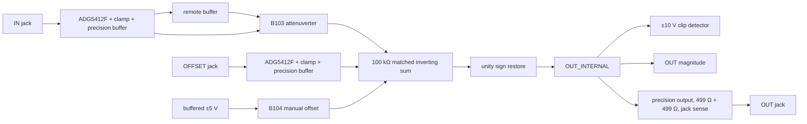

> **Unvalidated draft — not bench tested.** This capture is a proposed circuit, not a qualified pitch-CV processor or fabrication release.

A01–A06 are independent from the six envelope columns above them. Each occupies three locked jacks (`IN`, `OFFSET`, `OUT`), two locked pots (`ATTEN ±`, manual `OFFSET`) and four locked LEDs (IN magnitude, OFFSET magnitude, OUT magnitude and OUT clip). All 54 UIDs are read from `design/grid/placements.lock.json`; no panel centre moved. The R21 handoff defines `OUT = gain × IN + manual offset + OFFSET CV`, with gain intended from −1 to +1. OSC-ES-1 selects B103 10 kΩ behind input/remote buffers, B104 100 kΩ between buffered ±5 V, protected 100 kΩ input cells, precision output isolation and pre-isolation ±10 V clip sensing.

## Captured net contract

| Net | Connected pins | Value / note |
| --- | --- | --- |
| `IN_TIP`, `OFFSET_TIP` | Locked jack tip → ADG5412F source-facing switch → 10 kΩ/clamp input and 100 kΩ pulldown | Both inputs use the standard power-off isolation cell. Jack normal contacts are unused. |
| `IN_BUFFER`, `OFFSET_BUFFER` | Precision OPA4197 followers | IN also drives an isolated remote buffer for the panel ATTEN pot. Both have separate magnitude bridges. |
| `IN_REMOTE`, `ATTEN_OUT` | Remote buffer → B103 10 kΩ; wiper guarded by 1 kΩ and 10 MΩ fail resistor → precision attenuverter | With endpoint fraction α and matched 100 kΩ input/feedback, ideal `ATTEN_OUT = (2α−1) × IN_BUFFER`. The wiper drives the attenuverter amplifier's high-impedance non-inverting input through 1 kΩ; there is no separate wiper-buffer amplifier. No inverting summing node crosses the board interconnect. |
| `REF5`, `REFN5`, `MANUAL_OFFSET` | REF5050 local ±5 V buffers → B104 100 kΩ → precision follower | Ideal manual range −5 to +5 V; reference tolerance and source load remain unqualified. |
| `SUM_NEG`, `OUT_INTERNAL` | Three 100 kΩ inputs plus 100 kΩ feedback inverting summer → 100 kΩ unity inverter | The second stage restores the handoff sign. `OUT_INTERNAL` is the pre-isolation clip and magnitude monitor. |
| `CLIP_HALF`, `OUT_TIP` | Half-scale comparator against buffered ±5 V; precision output cell drives the jack through 2 × 499 Ω and senses it through 100 Ω with 1 nF local feedback | Ideal clip indication begins when the internal sum reaches ±10 V; threshold and load behavior need bench calibration. |

Signal critical parts are in `AO_CORE:${SHEETNAME}`; indicator drivers/LEDs are in `AO_INDICATORS:${SHEETNAME}`. The analog summing and feedback nets, precision input sense, references and clip divider are local, with `ATTEN_SUM`, `SUM_NODE`, `RESTORE_NODE`, `OUT_INTERNAL` and `CLIP_HALF` marked sensitive. The two panel pots may be remote only through the standard buffered source/wiper arrangement. Every component has `Block`, `Role`, `MPN`, `Manufacturer`, `LCSC` and applicable `Island` metadata. Exact resistor values without a verified orderable identity remain unresolved MPNs rather than silent substitutes.

## Range, headroom and error choice

Nominal intended ranges are `IN = ±5 V`, `OFFSET CV = ±5 V`, manual offset `±5 V`, and `gain = −1..+1`. The mathematical sum reaches **±15 V** when all three contributions align; a ±12 V powered amplifier cannot reproduce that. The design retains the full controls and lights clip around ±10 V internally. At the extremes it must saturate; recovery, error sign, actual output swing into load and how the clip LED behaves during rail limiting are bench gates. The ideal SPICE transfer decks include ±15 V mathematical cases solely to check wiring algebra, with unlimited ideal op-amp rails. They do not claim a physical ±15 V output. A narrower manual ±2 V range was considered, but would change the handoff's useful offset role; ±5 V plus explicit clipping is the planning default. An unisolated ±10 V manual reference and a general output cell were rejected for headroom and pitch-CV error risk.

Precision was chosen to keep pitch-CV use plausible, not qualified. At 1 V/oct, **1 mV = 1.2 cents**. An illustrative budget for a 1 V signal uses nominal circuit gains and the separately stated source test conditions:

| Contribution | Assumption and worst illustrative term | Cents at 1 V |
| --- | --- | ---: |
| Matched 100 kΩ ratios at gain endpoint | Opposing 0.1% tolerances give a ratio factor `1.001/0.999`. Three cascaded ratios at the negative gain endpoint give `(1.001/0.999)^3 − 1 ≈ 0.006018`, or about 6.02 mV. The positive endpoint partly cancels the attenuverter ratio. This term excludes loading and the other error mechanisms below. | ≈7.22 |
| OPA4197 offset in core signal path | The five selected IN-path stages have nominal offset coefficients `(2β−1), 2β, 2, −4, 2` (polarity convention aside). Their absolute sum is at most 11, giving 1.1 mV with a 100 µV per-stage assumption. The three-input summer has noise gain 4. The source VOS row specifies ±18 V, 25 °C and midsupply common mode; this is not a whole-cell ±12 V guarantee. | 1.32 |
| OPA4197 temperature drift | Nominal coefficient sum 11 × 2.5 µV/°C × 50 °C = 1.375 mV illustrative change. The source drift row uses ±18 V, common mode `(V+)−3 V`, and −40…125 °C; the separate near-positive-rail row is 4.5 µV/°C. This is not a project-temperature guarantee. | 1.65 |
| Endpoint/contact, B103 taper, reference accuracy, resistor TCR, leakage, loading | No complete exact-part/temperature/assembly evidence. | **Unbounded here** |

Here `β` is the loaded nominal wiper fraction. For an ideal remote source and nominal B103 resistance, `β = α × 10 MΩ / (10 MΩ + 1 kΩ + 10 kΩ × α(1−α))`, so `0 ≤ β < 1`. The five stages are the IN input buffer, remote follower, attenuverter, summer and sign restore. There is no extra wiper follower.

This is a **partial illustrative budget**, not a guaranteed sum in cents. The offset terms use nominal resistor ratios and omit the separate OFFSET input buffer, manual/reference paths and precision jack-output amplifier. Source impedance, real loading, amplifier input currents and simultaneous resistor errors also need a complete analysis. The [retained TI source](https://www.ti.com/lit/ds/symlink/opa4197.pdf) is SBOS737C, physical PDF index 6 / printed page 7, Section 6.7 VOS and drift rows (`src-op-precision-datasheet`; `fact-op-precision-input-offset-voltage`). Calibration must measure zero at ATTEN centre, ±1 endpoint gain, OFFSET CV unity, manual midpoint/endpoints, output DC and drift, and clip thresholds at ±10 V. An owner-defined cents tolerance is still required before accepting pitch-CV service.

## Model and current evidence

Seven ideal-opamp ngspice DC cases in `design/spec/modules/spice/offset-*.cir` check gain −1/0/+1, mixed offset/CV and the mathematical ±15 V extreme. Every modeled `OUT_INTERNAL` differs from the algebraic target by under 1 mV. Before execution, `offset_model_contract.py` checks the captured resistor values and nets, amplifier inputs/output pins, wiper polarity and internal branch set. A wrong wire, swapped amplifier input, missing/duplicate/DNP modeled part or added internal branch is rejected before the ideal deck can return a misleading pass. The report records the checked projection and its idealized boundaries. Pot contact resistance, saturation, op-amp macromodel, output isolation, LEDs, temperature and recovery are not modeled. `design/reports/spice/offset.json` records the runs.

The planning worksheet `design/reports/current/offset.json` counts per cell three whole OPA4197 packages, one OPA4196, two ADG5412F, two comparator packages, one REF5050, three magnitude LEDs, one clip LED, manual pot, input feeds and an output load. The six-cell **planning upper** is +12 V 196.95 mA, −12 V 173.55 mA and +5 V 1.8 mA. Guaranteed maxima are null. The amount is material to #33/#34 rail closure and could force topology/package consolidation; it is neither a measured current nor a supplier guarantee.

## Bench and partition gates

Verify the actual B103/B104 endpoint and centre transfer, 100 kΩ input impedance and power-off patch behavior; probe remote-pot wiper failure, cable capacitance and op-amp stability; check sum clipping and recovery for all extreme combinations, jack loading and shorts; measure LED thresholds/brightness without disturbing the precision path; compare source-to-output cents error and drift over temperature; and measure reference/rail load at startup and steady state. Board partition must keep the sensitive summing/feedback nodes with their amplifiers and provide a documented interconnect for the buffered pot signals. The final mechanical stack and installed control fit remain unqualified.

## Source I/O allocation

[Issue #60's source partition](./osc-io-partition.mdx) assigns raw jack, input isolation/clamp, local output feedback and magnitude drivers to the jack region, with complete fitted packages and local bypasses. The generated manifest is the current allocation authority; earlier broad module-island descriptions above describe the logical circuit grouping. Only checked buffered signals, conditioned logic, references, permitted wipers, and power/AGND are candidate connector nets. Physical boards and connector loads remain #35 work; this is an unvalidated draft.
