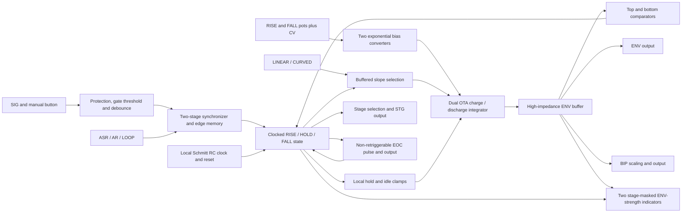

:::caution[Unvalidated draft — not bench tested]
Authority: **PROPOSAL (planning, owner-delegated)**. G07 semantics below are the
chosen capture contract and remain an owner-confirmation item. No hardware
performance, production readiness or fabrication release is claimed.
:::

## G07 truth table — frozen before circuit capture

SIG is a gate/trigger input, with no envelope-follower mode. The debounced button
is ORed with SIG before edge detection: pressing the button while SIG is already
high does not create another edge. The table's gate is this combined gate.
Every rising edge retriggers **from the present envelope voltage**, without a
reset discontinuity. A held gate is not a stream of triggers.

| Mode | Current state | Combined rising edge | Combined falling edge | Without another edge |
| --- | --- | --- | --- | --- |
| ASR | Idle | Rise | Remain idle | Remain idle |
| ASR | Rise | Continue rise from present level | Fall immediately at next state clock | At peak, sustain while gate remains high |
| ASR | Sustain | Remain at peak; rise request resolves at peak | Fall | Hold peak while gate high |
| ASR | Fall | Rise from present level | Continue fall | Bottom ends cycle |
| AR | Idle | Rise | Remain idle | Remain idle |
| AR | Rise | Continue rise from present level | Continue rise | Peak starts fall |
| AR | Sustain | Rise request | Fall because ASR was exited | Fall; sustain is not an AR state |
| AR | Fall | Rise from present level | Continue fall | Bottom ends cycle |
| LOOP | Idle | Rise | No effect | Start after EOC pulse ends |
| LOOP | Rise | Continue rise from present level | Continue rise | Peak starts fall |
| LOOP | Sustain | Rise request | Fall because ASR was exited | Fall; sustain is not a LOOP state |
| LOOP | Fall | Rise from present level | Continue fall | Bottom ends cycle, then restart after EOC |

START has priority over a coincident top/bottom crossing. ASR with a low combined
gate releases an active rise on the next clock. A manual press has the same
behavior as a gate high; releasing it ends ASR when no external gate holds it.
Mode changes preserve the present voltage: leaving ASR sustain begins fall;
entering LOOP starts an idle envelope; entering ASR with a low gate releases a
rise. SHAPE changes the instantaneous slope without resetting the integrator.
The default physical toggle choices are AR, LINEAR and RISE; the circuit cannot
move a toggle at power-up.

| State / event | EOC | STG and stage lamps |
| --- | --- | --- |
| Idle | Low, except the pulse just started by a completed fall | STG low; both lamps dark |
| Rise | Normally low; an earlier EOC pulse may finish during external retrigger | STG high if RISE selected; rise lamp follows ENV strength |
| Sustain | Normally low; no pulse generated by entering sustain | STG low; both lamps dark |
| Fall | Low until bottom completion; no EOC from an interrupted fall | STG high if FALL selected; fall lamp follows ENV strength |
| Completed fall | Nominal 3.3 ms positive pulse independent of the next state | Lamps follow the actual next state |
| Reset/startup | Forced low | STG low; both lamps muted |

Busy-trigger rejection and reset-to-zero retrigger were rejected because the
handoff's ideal engine retriggers from its current level. Its cubic interpolation
and preview time constants are not adopted as circuit values.

## Signal and state architecture

`design/spec/modules/envelope_logic.py` owns the state expressions and truth
contract. `envelope.py` compiles them into the actual HC00 NAND graph and HC74
flip-flops; tests compare that packed physical pin graph against an independent
truth-table evaluator. State is one-hot RISE/HOLD/FALL; all zero means IDLE.
A two-stage synchronizer handles each of the combined gate, ASR selection and
LOOP selection, and each of the top/bottom comparator flags. A further flip-flop
remembers the previous combined gate. Completion is registered for a full state
clock, so the HC221 never relies on a pulse shortened by a coincident state change.

A clocked machine was chosen to avoid relying on narrow pulses created by
asynchronous state-feedback delays. An asynchronous set/reset latch would use
fewer packages but would need a separately qualified priority/race design.
This implementation uses **nine SN74HC74DR, seventeen SN74HC00DR and two SN74HC14DR**
packages per instance, including unused channels. All run at +5 V/AGND. This is
substantially larger than the handoff's rough two-logic-IC estimate; board fit and
instrument current planning must use the captured count.

Two LM393BIDR packages run at **+12 V/AGND**. Their open-collector outputs pull up
to +5 V before HC14 conditioning, so negative comparator output voltages never
enter HC logic. The envelope comparators observe the existing buffered **ENV + 1 V** signal,
keeping their inputs positive even during small floor undershoot. Local 100 kΩ /
10 MΩ hysteresis networks give nominal top assertion/release near 7.960/7.911 V
and bottom assertion/release near 0.050/0.100 V. The lower top threshold lets the
8 V clamp settle without comparator chatter while flags synchronize. Threshold
resistors should be 0.1%; exact value sourcing and actual thresholds remain open.
The standard SIG front end uses its biased divider and nominal
1.47 V rising / 0.97 V falling thresholds; actual acceptance and fault behavior
remain bench gates. Short input pulses can be missed by the synchronous machine.
Use at least **0.5 ms high and low** as a provisional external trigger target;
this is not a qualified minimum across clock and device tolerances.

One additional **CD74HC221M96** section generates EOC with 47 kΩ and 100 nF C0G,
nominal `0.7RC = 3.29 ms`. This existing source-backed one-shot is an explicit
addition to the HC74/HC00/HC14 state-logic choice. It avoids using uncertain
combinational feedback as a pulse-width timer. The second section is held reset.
The physical one-shot is non-retriggerable while active; actual pulse width,
minimum trigger width and startup behavior still need qualification.

## Electrical interface and capture

E1–E6 bind **108 fixed panel UIDs**, eighteen per instance: seven jacks, six
controls, three magnitude indicators and two stage indicators. Internal instance
indices **41–46** are reserved next to instrument registration. Hardware
coordinates and locked references remain unchanged; every jack switch contact
is unused. No signal is secretly joined between modules.

OSC-ES-1 cells provide three source-facing ADG5412FBRUZ input isolators, protected
100 kΩ inputs, buffered B104 100 kΩ manual pots and identical general output
buffers with **2 × 499 Ω / 0.5 W** isolation. RISE/FALL have no depth controls;
their CV scaling is fixed below. MODE, SHAPE and STAGE carry ground/logic contact
signals only. The button contact filter is increased from the standard starting
100 nF to **1 µF**: approximately 11 ms release filtering and 1 ms press filtering.
Toggle filters remain the standard starting values. This is filtering, not a
claim of bounce-free behavior for every switch.

Audio/CV/indicator amplifiers resolve to OPA4196IDR; precision roles resolve to
OPA4197IPWR. The capture contains seven OPA4196 quads and three OPA4197 quads per
instance. Whole packages and unused terminated channels are counted. Five
ADG5412F packages comprise the three input protectors, a four-channel slope
selector and a local storage-clamp package. One LM13700M/NOPB provides the two
OTA sections. REF5050AIDR and local buffers provide references.

The shared source generates `schematic/sheets/envelope.kicad_sch`. The integrator
and stage-indicator groups stay on one schematic sheet so local labels cannot
accidentally join E1–E6 through global cross-page nets. Their physical islands
remain separate. The imported handoff sheet numbers are functional group names,
not a requirement to make their signals global.

### Principal nets

| Net | Connected pins | Value / note |
| --- | --- | --- |
| SIG_BUFFER | Protected input buffer, gate-input divider, magnitude indicator | Nominal bipolar input accepted through the standard protection chain |
| GATE_RAW | HC00 OR of SIG_GATE and debounced TRIG_ACTIVE, first synchronizer D | A high source masks further presses/edges on the other source |
| CLOCK | HC14 oscillator output, all seventeen active HC74 clocks | 47 kΩ feedback, 1 nF C0G local capacitor; nominal tens of kHz |
| READY | Second reset-release flip-flop Q, state/synchronizer clears, EOC clear | Active high; asynchronous assertion, clocked release |
| RISE / HOLD / FALL | Three state flip-flop Q outputs, NAND next-state logic and analog enables | One-hot; IDLE is all zero |
| COMPLETE | Registered READY AND FALL AND BOTTOM AND NOT START | Full-clock EOC trigger; interrupted/retriggered falls do not complete |
| TOP_LOW | LM393B output, 4.7 kΩ pullup, HC14 | Plus REF9 through 100 kΩ with 10 MΩ output feedback; minus ENV + 1 V |
| BOTTOM_LOW | LM393B output, 4.7 kΩ pullup, HC14 | Plus ENV + 1 V through 100 kΩ with 10 MΩ feedback; minus FLOOR_REF |
| RISE_IABC / FALL_IABC | LM13700 pins 1 / 16, respective PNP feed through 22 kΩ | Separate exponential current commands |
| RISE_OTA_SIGNAL | LM13700 pin 3, selected rise slope via 899 kΩ/1 kΩ divider | Pin 4 receives rise offset trim |
| FALL_OTA_SIGNAL | LM13700 pin 13, selected fall slope via 899 kΩ/1 kΩ divider | Pin 14 receives fall offset trim |
| RISE_OTA_CURRENT / FALL_OTA_CURRENT | LM13700 pins 5 / 12, separate 100 Ω summing resistors | Current outputs combine at storage through the resistors |
| ENV_STORAGE | Timing capacitor, two current-summing resistors, hold/idle clamp resistors, buffer input | **Sensitive**, 100 nF C0G; only local integrator circuitry connects |
| ENV_BUFFER | High-impedance buffer output, comparators, curve summers, outputs and stage indicators | The LEDs never observe ENV_STORAGE directly |
| HOLD_CLAMP / IDLE_CLAMP | Local ADG5412F drains, respective 100 Ω storage resistors | HOLD/top targets REF8; idle/reset/bottom targets AGND |
| REF8 / REF9 | Reference-buffer outputs | Nominal 8 V peak and 9 V curved-rise target |
| REF1 / FLOOR_REF | Reference buffer / divider | 1 V pedestal; 79 kΩ/22 kΩ divider gives FLOOR_REF = 110/101 V, yielding 50 mV falling threshold |
| BIP_CORE | Scaling amplifier output | Nominal `1.25 × ENV_BUFFER − 5 V` |
| NOT_RISE / NOT_FALL | NAND outputs, stage-cell mute MOSFET gates | High mutes its own LED; ENV/16 commands 0.5 mA at 8 V |
| EOC_RCX / EOC_C | HC221 pins 15 / 14, timing resistor/capacitor | **Sensitive**, local; Q pin 4 feeds EOC buffer |
| ENV_TIP / BIP_TIP / EOC_TIP / STG_TIP | General output cells, corresponding jack tips | Nominal ENV 0…8 V, BIP −5…+5 V, gates 0/+5 V, before load droop |

For the LM13700, supply pins are 11 = +12 V and 6 = −12 V; linearizing-diode
pins 2/15 are unconnected. Unused Darlington inputs 7/10 are grounded and outputs
8/9 are unconnected. Logic/comparator pin mappings come from the retained TI
sources and `design/standard/pin-maps/`; no pinout is inferred from an IC name.

## Rate law, shapes and limits

The two manual pots produce 0…5 V. Each time command is
`manual + 0.5 × external CV`, followed by a resistor/Schottky clamp near 0…5 V
and a local buffer. **Clockwise and positive CV lengthen the time.** The nominal
law is two octaves of time per manual volt and one octave per external CV volt:
+1 V CV approximately doubles time. This is a room-temperature control target,
not pitch tracking or a calibrated time guarantee.

Each matched BCM847BS NPN pair has a servoed reference branch fed through
300 kΩ plus a 50 kΩ trim. A 100 kΩ input, 3.3 kΩ plus 1 kΩ scale-trim feedback,
and −5 V offset feed produce approximately `−36 mV × (command − 2.5 V)` at the
other transistor's base. Start the reference trim near 20 kΩ active resistance
and scale trim near 300 Ω. A discrete MMBT3906 pair mirrors each current into its
OTA. Base current, mirror mismatch/Early effect, temperature and compliance
change this approximation. There is no temperature compensation.

At the nominal fastest setting, each bias is approximately **500 µA**. At the
slowest manual setting it is approximately **0.488 µA**, a 1024:1 target ratio.
The 22 kΩ mirror-reference and OTA feed resistors limit available current; they
do not establish a guaranteed fault-current bound. The Schottky clamps extend
past their reference rails by a forward drop. External CV therefore reaches
soft clipping/compliance limits, not exact mathematical endpoints.

In LINEAR mode, the selected 9 V source is attenuated by 1/900 to 10 mV at the
active OTA input. Using the ideal typical relation `gm ≈ 19.2 × IABC`, a 100 nF
capacitor targets approximately **8.29 ms…8.49 s rise to the top trip** and **8.28 ms…8.48 s fall**
from 8 V to the 50 mV completion threshold. Short interrupted/retriggered stages
use only their remaining voltage excursion; they do not consume a fresh full
stage duration.

CURVED selects `(9 V − ENV)/900` for rise and `(ENV + 1 V)/900` for fall.
The rise approaches +9 V exponentially, trips near 7.960 V and settles to the
8 V clamp target; the fall approaches
−1 V exponentially and stops near 50 mV. This gives the requested fast initial
rise and exponential fall while crossing finite thresholds. It does not reproduce
the preview's cubic easing exactly. Approaching precisely 8 V/0 V was rejected
because a pure exponential never reaches its target in finite time.

With `τ = 900C/gm`, curved threshold times are `τ ln(9/(9 − 7.960396))` and `τ ln(9/1.05)`:
approximately **20.23 ms…20.72 s rise**, **20.14 ms…20.63 s fall** at the manual
endpoints. **SHAPE changes duration as well as curvature**; no normalization
compensates that difference. Noise/leakage/offset will dominate before arbitrary
very-long times are usable; the stated endpoints require bench verification.

The nominal fastest full LOOP is about **20 ms LINEAR** or **44 ms CURVED**,
including EOC and clock quantization. The top clamp finishes the last roughly
40 mV of rise; state durations add the comparator synchronization latency. Maximum available bias, timing capacitance,
state-clock latency and the EOC pause prevent a zero-duration loop in the proposed
circuit. These numbers are model/design targets, not worst-case minimum periods.
The independent RC oscillator has threshold-dependent frequency; the model's
50 µs clock is a fixture, not a measured or guaranteed oscillator period.

## Peak, outputs and startup

During HOLD, the local analog switch connects the integrator through 100 Ω to
buffered REF8. The same clamp engages on the raw top flag during RISE. During
IDLE/reset, or on the raw bottom flag during FALL, another channel connects it
through 100 Ω to ground. These local clamps bound voltage while the synchronized
comparator flags propagate into the clocked state machine. This actively targets the sustain/idle level rather than relying on
perfectly zero OTA leakage. The physical clamp is part of the local integrator;
its settling, leakage and offset under both OTA bias currents remain unverified.
There is no clamp/reset on an ordinary mid-level retrigger. Small deviations
past 0/8 V are expected from finite clamp resistance and clock latency; the model
bounds them within 25 mV, not a hardware guarantee.

ENV is nominally 0…8 V. BIP uses a 64 kΩ/80 kΩ input divider and a summer gain of
2.25 with an equal-feedback −5 V reference contribution, yielding
`1.25 × ENV_BUFFER − 5 V`. The equation uses the **internal buffered ENV**;
independent cable loads introduce jack-level differences. All four outputs use
998 Ω isolation, so a 100 kΩ load reduces voltage by about 0.99%, and 10 kΩ by
about 9.08%. These output stages still need short/fault and cable-stability tests.

A 100 kΩ/1 µF reset network, discharge diode and two HC14 stages assert reset
at initial power-up; two flip-flops release it on clock edges. The proposed normal
startup state is IDLE, storage near zero, BIP near −5 V, EOC/STG low and both
stage lamps muted. LOOP then starts automatically. **A gate/button already high
when reset releases is accepted as one initial rising edge**: AR starts one
contour and ASR rises toward sustain. With low gate, AR/ASR wait for an edge.
The RC circuit is not a brownout supervisor and does not prove safe behavior for
slow, interrupted or independently sequenced rails. Those tests remain open.

## Calibration and partition

There are **six internal trimmers per instance**: base-current and slope
adjustments for each time converter, plus one offset trim per OTA. Exact 50 kΩ
trimmer procurement remains unresolved; a family footprint is not proof of an
orderable value. Other value-specific passive identities left blank in the
source remain sourcing gates. Factory soldering/adjustment is assumed; there
are no additional panel features.

1. Verify rails, +5 V logic, reference levels, reset assertion/release and clock
   frequency before connecting external signals. Confirm zero-state decoding and
   mutually exclusive analog drive enables.
2. Set both OTA offset trims with the corresponding drive disabled, observing
   buffered ENV/current drift across the bias range. The ±5 V trim tracks are
   attenuated by 470 kΩ/1 kΩ to approximately ±10.6 mV. One adjustment does not
   prove drift cancellation at every current or temperature.
3. Calibrate each fastest LINEAR time with its base trim, then repeat slow/mid/fast
   settings and adjust its exponential slope. Record actual endpoints and +1 V CV
   ratios. Iterate both adjustments; never describe the ideal law as measured.
4. Check ASR gate release during rise, sustain accuracy, retrigger during fall,
   all mode changes, held-input startup, button bounce and minimum accepted pulse
   width. Confirm STG selection and both stage LED masks, including darkness in
   HOLD and IDLE.
5. Measure EOC width, rejected retriggers during its pulse, minimum LOOP period,
   both CURVED trajectories, output scaling/loading, offsets, power faults and
   per-rail currents before treating the behavior as qualified.

`ENV_CORE:<instance>` contains integrator, timing/clock/one-shot parts, logic,
comparators, converters and buffers. `ENV_LEDS:<instance>` contains the three
magnitude and two stage-indicator driver groups. ENV_STORAGE, both converter
emitter/reference/collector nodes, CLOCK_RC and the EOC timing nodes are Sensitive.
No panel part connects to them. Panel pots carry buffered reference/control
voltages; switches and button carry logic/ground. Only rails and AGND are global.

## Executed evidence and limits

`python3 -m design.spec.modules.run_envelope_spice` runs the pinned oracle's
ngspice on six normal cases (three modes × two shapes), an early ASR release and
an AR retrigger during fall. The deck uses **the captured physical NAND/DFF pin
graph**, behavioral gates/master-slave latches, ideal comparators, ideal OTA
transconductance, switches and buffers. It imposes 500 µA bias, a 50 µs clock and
reset until 5 ms. The real transistor converters, analog device offsets/leakage,
RC clock/reset, HC propagation/metastability and actual HC221 dynamics are
**NOT RUN**. Its EOC fixture tracks completion for one state-clock interval and
adds 0.7RC; it does not establish real one-shot retrigger behavior or corner width.

| Shape, full stage | Calculated threshold rise / fall | ASR model rise / fall | AR model rise / fall | LOOP model rise / fall |
| --- | --- | --- | --- | --- |
| LINEAR, 500 µA | 8.292 / 8.281 ms | 8.400 / 8.400 ms | 8.400 / 8.450 ms | 8.400 / 8.450 ms |
| CURVED, 500 µA | 20.235 / 20.142 ms | 20.350 / 20.250 ms | 20.350 / 20.250 ms | 20.350 / 20.250 ms |

Model timing comparisons pass within 3%. The early-release fixture leaves rise
after 3.000 ms and completes its shortened fall about 3.050 ms later. The
retrigger fixture returns a falling envelope to rise without resetting storage.
Assertions check one-hot states, bounded ENV, BIP scaling, stage selection/masks,
EOC width and repeated LOOP starts. These are observations of the stated model,
not measurements of hardware. Exact run details and source hashes are retained
in `design/reports/spice/envelope.json`.

`bash design/spec/modules/check_envelope.sh` passes complete native pin/net
parity, all 108 panel bindings and six separately scoped storage nets. KiCad
10.0.6 reports **zero errors** and sixty explained LED pin-type warnings, ten per
envelope. `schematic/reports/envelope-erc-notes.md` records the warning basis.
Unused gates/complements are terminated or explicit NCs; nothing is suppressed.

Binding the fixed envelope hardware exposed existing D1301/RV1306 collisions
with internal oscillator components. With manager authorization, only oscillator
internal diode/trimmer prefixes became DO/RVO; all locked references and
oscillator connectivity are preserved. Whole-instrument reference uniqueness and
the oscillator native checker cover this bounded correction.

## Rail planning and open gates

The captured current worksheet counts complete packages, unused channels,
indicator loads, comparator/contact pulls, output loads and reference/current-
converter reserves. It supersedes the rough package count for this family.

| Scope | +12 V typical / planning upper | −12 V typical / planning upper | +5 V typical / planning upper |
| --- | --- | --- | --- |
| Each E1–E6 | 32.690 / 58.450 mA | 29.490 / 53.450 mA | 9.200 / 21.541 mA |
| Six envelopes | 196.140 / 350.700 mA | 176.940 / 320.700 mA | 55.200 / 129.249 mA |

**Guaranteed maxima are NOT ESTABLISHED**, represented by null in
`design/reports/current/envelope.json`. Logic dynamic current is an explicit
planning reserve, not a manufacturer limit or a SPICE current result. Comparator
negative-rail current is zero because they use +12 V/AGND. Both stage LEDs are
conservatively charged in the reserve even though one-hot operation enables only
one. No new module bulk is assigned. #33/#34 must reconcile these expanded counts,
startup and measured loads with the whole-instrument rail ceilings; this page
does not label that budget passing.

Open gates are G07 owner confirmation; exact unresolved passive/trimmer sourcing;
clock/reset/rail-sequence and brownout behavior; synchronizer and HC timing margins;
minimum trigger width and bounce; OTA/exponential converter offsets, leakage,
matching and temperature dependence; actual time endpoints and curved response;
clamp/hold accuracy; EOC width and non-retriggerability; stage LED brightness;
output protection, loading and cable stability; board fit/Sensitive-net routing
and remote harnesses; and measured current before supply-budget closure.
