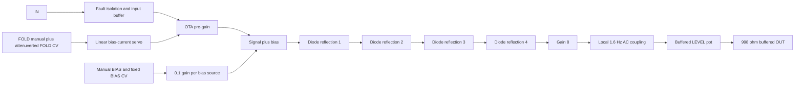

:::caution[Unvalidated draft — not bench tested]
Authority: **PROPOSAL (planning, owner-delegated)**. The topology, nonlinear values
and calibration targets below are engineering choices for this capture. Curves
are simulations with stated model limits; no measured sound, hardware fold count,
stability or fabrication readiness is claimed.
:::

## Contract and chosen signal path

**FOLD 2 / W2 stays on the left; FOLD 1 / W1 stays on the right.** This preserves
the explicit owner panel decision. The two instances bind 22 fixed UIDs: four
jacks, four controls and three input magnitude indicators each. Internal instance
indices are W2 = 51 and W1 = 52. No coordinates or locked references change;
all jack switch contacts remain unconnected.



Four cascaded reflection cells adopt the planning stage count. One LM13700M/NOPB
OTA section controls input gain; the whole dual package is populated and counted.
Manual bias and BIAS CV enter **after** that VCA, before folding. LEVEL follows
the folder. FOLD± acts only on FOLD CV. There is no extra bias-depth control.
FOLD at zero suppresses the IN branch; changing BIAS can still generate an output.

The fixed bias gain is **0.1 V/V**, replacing the planning suggestion of unity.
The ±5 V manual source therefore supplies ±0.5 V at the folding input, and a
nominal ±5 V BIAS CV adds another ±0.5 V. Unity bias would drive this four-stage
bank outside its useful folding range too easily. The reduced fixed gain retains
useful symmetry movement without adding an undocumented knob.

## Transfer law and fold count

Each stage has a 10 kΩ resistor into two antiparallel **Nexperia BAS16GW-QX**
diodes to ground. The op-amp non-inverting input observes that passive clamp
voltage `c(x)`; equal 100 kΩ input and feedback resistors give
`f(x) = 2c(x) − x`. Below diode conduction, `c(x)` follows the input and the
stage is approximately linear. As the clamp conducts, the slope reverses.
Four applications of this function give the final shape.

This is a smooth diode reflection, not a hard fixed-threshold triangular function.
A precision rectifier/clamp implementation could control thresholds more tightly,
but would add amplifiers and recovery/stability work. A rail-clipping stage would
flatten peaks instead of reflecting them. The selected passive clamp and local
negative-feedback amplifier give a compact, explicit transfer law.

At maximum FOLD, zero bias and ±5 V input, the retained model has **eight turning
points: four per input polarity**, near input magnitudes 0.54, 1.86, 3.28 and
4.77 V. Four reflection stages are the design choice; those voltages and the
physical number of visible folds are **not guaranteed** for actual BAS16 devices,
temperature or amplifier dynamics. Calibration and bench sweeps must establish
the usable range. Bias shifts the positions and can move a turning point outside
the input excursion.

### Required DC transfer curves

These twelve curves sweep buffered IN from −5 to +5 V at normalized manual FOLD
positions 0.05, 0.3, 0.6 and 1, with three injected manual bias values. FOLD CV and
BIAS CV are zero. They show **PRE_AC, before the coupling capacitor**. A steady
DC input at the output jack decays toward zero through the high-pass network.


The gain-8 stage is fixed; there is no automatic amplitude normalization.
At zero bias the model's internal peak magnitude grows from about 1.81 V at the
lowest plotted FOLD setting to 2.34, 2.53 and 2.77 V at the higher settings.
Some growth at low settings and ripple as folds appear are expected. LEVEL is
a buffered **0…1 attenuator**, useful for matching downstream levels; it does
not boost above the fixed output scaling.

## FOLD control and bias limits

FOLD manual is a buffered B104 100 kΩ source spanning 0…5 V. FOLD± is the standard
buffered B103 10 kΩ attenuverter. Their sum is limited approximately to 0…5 V by
a resistor and BAT54S clamp, then buffered. Forward drop means the limit is soft,
so overdrive can exceed the nominal command range.

A PNP emitter servo targets `5 V − command` and converts the command to current
through **12.4 kΩ**. Nominal full-scale bias is 403 µA, with a separate 22 kΩ
collector feed into IABC. This leaves nominal collector compliance at full command.
The servo has 10 kΩ base drive resistance, a reverse base-emitter diode and 100 pF
feedback compensation. Its actual stability, offset, corner limits and startup
behavior remain unqualified.

IN is attenuated by **200 Ω / (100 kΩ + 200 Ω) = 1/501** at the OTA. The active
section's polarity and inverting transimpedance amplifier restore positive gain.
Feedback is 49.9 kΩ plus a 10 kΩ calibration trim, with 5 kΩ active resistance in
the model. The intended pre-gain range is approximately **0…0.8** over 0…5 V
command, approximately linear. The model produces about 0.803 gain at full scale.
Negative command turns bias off; the positive soft-clamp allowance can raise gain
slightly beyond its nominal endpoint. This is not a precise multiplier or a
through-zero control law.

Normal design inputs are ±5 V for IN, FOLD CV and BIAS CV. Full manual FOLD gives
roughly ±4 V signal drive; both bias sources at their nominal extremes add up to
±1 V. Extra sweeps combine full positive fold-CV overdrive with both bias sources
at ±5 V. Their **internal PRE_AC** extrema are approximately −4.11/+4.37 V in
this model. These are tested model conditions, not hard hardware output limits.
Input faults, excessive CV, trim extremes and rail clipping remain separate gates.

## DC, audio output and control transients

The output is **AC-coupled**. Ten exact 100 nF C0G capacitors in parallel form a
nominal 1 µF series bank, followed by a local 100 kΩ return and high-impedance
buffer. This uses the retained 1206CG104J500NT part instead of inventing an exact
1 µF film identity. Nominal cutoff is **1.592 Hz**, with a 100 ms time constant.
This choice removes static bias offsets from the jack and attenuates very slow
CV applications. The coupling/storage node stays local; only buffered audio
reaches the remote LEVEL pot.

Bias and fold-control changes still produce transients. The OTA's control-dependent
offset cannot be nulled at every bias current with one trim. AC coupling removes
a steady offset after settling, but rapid knob/CV changes can click or produce
low-frequency content. A large DC step can also produce a temporary output swing
larger than the steady waveform peaks. No universal ±5 V output ceiling or
click-free modulation claim is made.

All exposed output current passes through the standard **2 × 499 Ω / 0.5 W**
isolation. A 100 kΩ load reduces level by about 0.99%, and a 10 kΩ load by about
9.08%. Cable stability, simultaneous loading, paired-output faults and actual
amplifier clipping remain bench gates.

### Sine-input model result

The transient uses a 100 Hz, ±5 V sine, maximum FOLD, +0.25 V injected manual bias,
full LEVEL and a 100 kΩ output load. After 700 ms, the model output spans roughly
**−2.614…+2.813 V**, with time-weighted mean **−1.17 mV** over 700–800 ms.
This is one settled model case, not a measured amplitude or DC-offset specification.


## Stability reasoning and diode matching

The interstage signal graph is acyclic: each reflection cell drives the next,
and no later-stage output returns to an earlier stage. Each cell's own output
returns only to its inverting input through a positive resistance; its clamp is
passive and driven by the preceding stage. There is no intentional regenerative
loop, oscillator, latch or hysteresis in the folding path. For the ideal passive clamp, `c(x)` has the sign of `x` and lies between zero
and `x`; consequently `|2c(x) − x| ≤ |x|`. Each stage is memoryless and bounded,
and composition preserves that bound. The resistor/diode equation has a unique
DC solution because its incremental conductance is positive. The high-pass
network has a positive RC decay constant.

This structural argument rules out a designed interstage regeneration mechanism.
**Physical stability still requires evidence** for local amplifier loop gain,
diodes and parasitics, the PNP bias servo, reference drivers and remote/output
loads. Ideal op-amps cannot establish their phase margins, and a completed sine
simulation cannot prove that every hardware feedback path is non-oscillatory.
Do not interpret the structural result as hardware stability sign-off.

BAS16GW-QX is the existing source-backed SOD123 choice; pin 2 is anode and pin 1
cathode. The simulated fold diodes use generic `IS=1 nA, N=1.8, RS=1 Ω,
CJO=2 pF, TT=4 ns` parameters. These are **not a manufacturer BAS16 model**.
Pair mismatch and temperature change thresholds, symmetry and fold count.
A deliberate 2:1 saturation-current mismatch in every positive diode produces
about **0.471 V maximum odd-symmetry error** at PRE_AC, compared with about
0.00434 V in the matched fixture. This is a sensitivity demonstration, not an
expected production spread. The simple exponential diode law suggests about
32 mV forward-voltage shift for that ratio under the model's conditions.

Use the same diode type and thermal environment for each pair. Binning or matching
requirements must follow measured transfer sweeps; no matching tolerance has been
invented from the generic parameters. The fixed bias control can shift symmetry,
but does not independently calibrate all four folding thresholds.

## Capture, nets and islands

`design/spec/modules/wavefolder.py` generates the shared sheet and registers W2/W1.
All components have identity/role fields; unresolved exact passive values retain
blank MPN fields. The generated Block field resolves per instance. OSC-ES-1 provides
three ADG5412FBRUZ-protected 100 kΩ inputs, OPA4196IDR audio/CV/indicator roles,
OPA4197IPWR precision reference roles, buffered controls and output isolation.
Three magnitude drivers observe only IN/FOLD/BIAS buffers. There is no OUT LED.

| Net | Connected pins | Value / note |
| --- | --- | --- |
| IN_BUFFER | Protected input buffer, magnitude monitor, 100 kΩ OTA attenuator feed | Nominal ±5 V signal |
| FOLD_DEPTH | Standard buffered attenuverter output, control summer | Approximately −1…+1 times FOLD CV |
| COMMAND | Clamp buffer, current-command subtractor | Approximately 0…5 V, soft-clamp excursions possible |
| EMITTER | PNP pin 2, 12.4 kΩ from REF5, servo inverting input | Servo targets REF5 − COMMAND |
| IABC | PNP collector through 22 kΩ, LM13700 pin 1 | Nominal 0…403 µA |
| OTA_SIGNAL / OTA_OFFSET | LM13700 pins 4 / 3 | IN/501 and attenuated offset trim |
| PRE_GAIN_SUM | LM13700 pin 5, TIA minus input and gain feedback | **Sensitive**, local; 49.9 kΩ plus 10 kΩ trim feedback |
| FOLDER_SUM / FOLDER_DRIVE | Input/bias summer and polarity-restoring amplifier | PRE_GAIN + 0.1 × BIAS_MANUAL + 0.1 × BIAS_BUFFER |
| F1_CLIP…F4_CLIP | 10 kΩ stage feed, antiparallel diodes, op-amp plus input | **Sensitive**, local nonlinear nodes |
| F1_SUM…F4_SUM | Op-amp minus input, 100 kΩ previous-stage input and own-output feedback | **Sensitive**, negative local feedback |
| F1_OUT…F4_OUT | Stage outputs | Strictly forward stage-to-stage signal path |
| PRE_AC | Gain-8 amplifier output, ten 100 nF series-bank capacitors | DC transfer curves refer to this node |
| AC_NODE | Capacitor bank, 100 kΩ return, buffer plus input | **Sensitive**, local coupling storage |
| LEVEL_REMOTE | Standard isolated remote driver and 10 kΩ LEVEL high end | Low end AGND; wiper buffered locally |
| OUT_TIP | General output buffer through 998 Ω, jack tip | AC-coupled folded audio after LEVEL |

The LM13700 supply pins are 11 = +12 V and 6 = −12 V. Its second OTA is unused:
IABC pin 16 returns through 100 kΩ to −12 V; inputs 13/14 are grounded, output 12
unconnected. Linearizing-diode pins 2/15 are unconnected. Darlington inputs 7/10
are grounded and outputs 8/9 unconnected. The whole dual package remains in the
current count; unused does not mean zero supply current.

`FOLDER_CORE:<instance>` holds the nonlinear stages, coupling bank, bias servo
and local buffers. `FOLDER_LEDS:<instance>` holds the indicator circuitry.
Sensitive nodes never reach a panel part or harness connector. FOLD/BIAS manual
pots are remote-safe B104 100 kΩ controls; FOLD± and LEVEL retain buffered B103
10 kΩ tracks. Only rails and AGND are global.

## Calibration and verification

There are **two internal adjustments**, replacing the rough one-trimmer estimate:
OTA offset and maximum pre-gain. Factory soldering/adjustment is assumed.

1. Verify rails/references and input/output protection with a current-limited
   supply. Check the bias-current servo over negative, zero, mid, full and
   overdriven command before large signal sweeps.
2. At full FOLD and zero input/bias, null PRE_GAIN with the offset trim. Its ±5 V
   track is attenuated by 470 kΩ/1 kΩ to about ±10.6 mV. Repeat at other currents
   and record residual control feedthrough; one trim does not cancel all offsets.
3. Set the gain trim for approximately 0.8 pre-gain with a small known input.
   The model's active gain-trim resistance is 5 kΩ and its offset-wiper fixture
   is +0.332 V. These are model settings, not factory values measured on hardware.
4. Sweep the actual transfer at the four FOLD and three BIAS settings. Confirm
   fold positions, polarity, peak levels, matching sensitivity and internal
   headroom before accepting the intended maximum fold count.
5. Check AC cutoff/settling, LEVEL endpoints and disconnected-wiper behavior,
   CV-step clicks, noise/distortion, high-frequency response, local-loop and
   cable-load stability, rail startup and faults. Measure per-rail current.

The pinned oracle runs through `python3 -m design.spec.modules.run_wavefolder_spice`.
It performs an offset fixture sweep, sixteen DC cases (twelve required curves,
two combined control-limit cases, mute and diode mismatch), and one sine transient.
The signal path, PNP control servo, resistor/capacitor values and physical OTA
pin mapping come from the captured source. Front-end/control outputs and references
are imposed fixtures; actual protection and remote CV behavior are not modeled.

The retained TI/National LM13700 model comes from the existing SNOM267 receipt
under `design/spec/modules/spice/filter-model/`. Its header warns that its
single-pole approximation can overestimate bandwidth/phase margin by **over 2×**.
Amplifiers are ideal; only the bias-servo amplifier has a smooth ±10.5 V bound.
Other model internal voltages are checked against that planning headroom envelope.
PNP, clamp and folding-diode models are generic. Real saturation, slew, phase
margin, device corners and actual supply current are **NOT RUN**.

Plots are produced by `plot_wavefolder.py` from the oracle traces using pinned
matplotlib 3.9.2. `wavefolder-plot-requirements.txt` pins its disposable environment:

```sh
uv venv --python 3.10 .circuit-cache/wavefolder-plot
uv pip install --python .circuit-cache/wavefolder-plot/bin/python -r design/spec/modules/wavefolder-plot-requirements.txt
.circuit-cache/wavefolder-plot/bin/python -m design.spec.modules.plot_wavefolder
```

`design/reports/spice/wavefolder.json` records cases and source hashes;
`wavefolder-plots.json` records the PNG hashes. The native checker verifies
complete pin/net parity, all 22 bindings and separate coupling nodes. KiCad 10.0.6
reports zero errors and twelve justified input-LED pin-type warnings, recorded
in `schematic/reports/wavefolder-erc-notes.md`; no suppressions are used.

## Rail planning and open gates

Each instance contains seven OPA4196 quads, one OPA4197 quad, three ADG5412F
packages, one LM13700 dual and one REF5050. The worksheet replaces a single
preliminary internal-current allowance with explicit trim/pot/harness, diode
feed, feedback, bias-servo, reference and captured-resistor branch estimates.
Whole packages and unused sections are charged. There is 2.5 µF of distributed
IC decoupling plus the separate 1 µF audio-coupling bank; no new module bulk.

| Scope | +12 V typical / planning upper | −12 V typical / planning upper | +5 V typical / planning upper |
| --- | --- | --- | --- |
| Each W2/W1 | 19.661 / 44.219 mA | 17.611 / 41.169 mA | 0.150 / 0.250 mA |
| Both wavefolders | 39.322 / 88.438 mA | 35.222 / 82.338 mA | 0.300 / 0.500 mA |

**Guaranteed maxima remain NOT ESTABLISHED**, represented as null. Branch bounds
assume the stated normal voltage envelope and are conservatively charged to both
rails; typical entries are planning allocations, not measured averages. Startup,
dynamic control steps, component corners and output faults are not bounded by
this table. #33/#34 must reconcile the actual instrument counts and measured loads;
this page does not declare its supply budget passing.

Open gates: unresolved exact passive/procurement choices; actual diode thresholds,
matching and fold count; OTA/control offsets and gain; curve and temperature
behavior; PNP/local-amplifier/remote-load stability; output peak/DC transient limits;
protection/startup; AC capacitor and harness behavior; noise/distortion/bandwidth;
board fit and Sensitive-node routing; and measured rail-current closure.

## Source I/O allocation

[Issue #60's source partition](./osc-io-partition.mdx) assigns raw jack, input isolation/clamp, local output feedback and magnitude drivers to the jack region, with complete fitted packages and local bypasses. The generated manifest is the current allocation authority; earlier broad module-island descriptions above describe the logical circuit grouping. Only checked buffered signals, conditioned logic, references, permitted wipers, and power/AGND are candidate connector nets. Physical boards and connector loads remain #35 work; this is an unvalidated draft.
