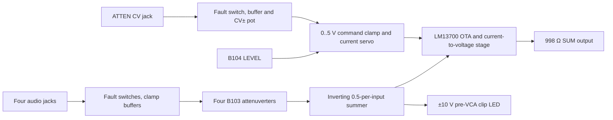

> **Unvalidated draft — not bench tested.** The fixed-calibration fixture meets its bounded waveform and zero-bias checks; feedthrough and real amplifier headroom remain open. This does not qualify the circuit. Hold procurement and fabrication until the electrical gates below close.

M4A and M4B share `schematic/sheets/mix4_vca.kicad_sch`. Each instance binds six locked jacks, six controls and seven LEDs exactly once. Four jacks are DC-coupled audio inputs through source-facing ADG5412F protection, buffered B103 attenuverters and individual magnitude indicators. `ATTEN` is a **CV-only** jack, protected and buffered like an input; its magnitude indicator monitors the CV before the CV± depth pot. The fifth control path never enters the four-channel audio summer. Active roles use OSC-ES-1 OPA4196IDR for audio/CV/indicator stages, OPA4197IPWR for the local precision reference, LM393BIDR for the clip window, and LM13700M/NOPB for the VCA. Exact package and pin identities come from the retained library evidence; non-shortlist passive values keep blank MPN fields until sourced.

| Net | Connected pins/functions | Value / note |
| --- | --- | --- |
| `n_TIP` | Audio jack tip to ADG source, `n=1..4` | Jack normal contact unused. |
| `n_GAIN` | B103 attenuverter to 100 kΩ summer resistor and LED | Nominal bipolar input contribution. |
| `SUM_NODE` | Four 100 kΩ inputs and 50 kΩ feedback | Sensitive local virtual ground. |
| `SUM_PRELEVEL` | Summer output, pre-VCA clip cell, 100 kΩ OTA divider top | Requested ±10 V with four coherent ±5 V inputs. |
| `ATTEN_TIP` | CV jack to ADG switch and protected high-impedance buffer | Not an audio-sum input. |
| `CV_DEPTH` | B103 CV± output to 100 kΩ command summing input | Nominal ±5 V depth for ±5 V CV. |
| `COMMAND` / `IABC1` | nominal 0..5 V Schottky clamp, PNP servo, 10 kΩ sense and collector limit | Requested 0..500 µA; max-safe behavior unqualified. |
| `OTA_SIGNAL` / `OTA_CURRENT` | 100 kΩ / 100 Ω divider and OTA output to TIA | Sensitive, local to core island. |
| `SUM_POSTVCA` | TIA output to SUM output and magnitude cell | Unity at +5 V is a calibration target, not a model pass. |

**Design choice:** 50 kΩ summer feedback limits four coherent ±5 V inputs to a requested ±10 V. Unity feedback would request ±20 V. DC coupling preserves audio and CV offsets. A linear bias-current command was chosen over an exponential response because LEVEL and ATTEN represent gain, not pitch. Negative command clips to zero rather than reversing gain. The clip window senses before the VCA so reduced gain cannot hide summer overload. Exact OTA gain, maximum usable gain and feedthrough remain bench calibration gates.

Four 100 kΩ input resistors and 50 kΩ feedback request `SUM_PRELEVEL = -0.5 × sum(input gains)`. Four coherent +5 V inputs request −10 V pre-VCA. The clip LED monitors that node through the standard ±10 V window, independent of manual LEVEL and CV. `SUM` magnitude monitors the VCA output, then the standard output cell adds 998 Ω isolation.

The B104 LEVEL pot requests 0 to +5 V. The B103 CV± attenuverter contributes signed ATTEN CV to that command; the command is Schottky-limited near 0 to +5 V. Diode forward drop permits a small over/undershoot, so this is not a guaranteed hard limit. Negative combined control requests zero OTA bias; residual leakage must be measured. A 10 kΩ emitter sense resistor requests approximately 0 to 500 µA through the PNP servo; a 10 kΩ collector resistor limits a supply fault to approximately 1.7 mA under the simple 17 V worst-path estimate, below the LM13700 2 mA absolute bias-current rating. This is a **proposal**, not a guaranteed fault or temperature bound. The first OTA channel of LM13700M/NOPB receives the pre-VCA sum through a 100 kΩ / 100 Ω divider (about ±10 mV at ±10 V); its output drives an inverting current-to-voltage stage with 100 kΩ fixed plus 0–10 kΩ calibration trim. The nominal 25 °C `gm ≈ 19.2 × IABC` datasheet relation suggests approximately 104.2 kΩ feedback for unity at +5 V command. The 100–110 kΩ trim span therefore suggests approximately 0.96–1.06 maximum-command gain *in that small-signal equation*; real maximum gain and linearity are unqualified. This is a planning calculation, not a calibrated gain law. A 10 kΩ offset trim through 1 MΩ spans roughly ±5 mV of input correction for feedthrough. The second OTA channel has grounded inputs, bias held at −12 V through 100 kΩ, and explicit unused outputs/diode/buffer pins. Both unused Darlington buffers have grounded inputs.

The retained TI/National single-OTA macromodel (`design/spec/modules/spice/filter-model/LM13700.MOD`, SNOM267 receipt; manufacturer datasheet `circuit/sources/ic-library/LM13700.pdf`) has the pin order IABC, diode bias, positive input, negative input, current output, negative rail, buffer input, buffer output, positive rail. The fixture maps these to physical OTA1 pins 1, 2, 3, 4, 5, 6, 7, 8, 11. Its untrimmed +5 V command / four coherent 5 V peak baseline was **+6.897/−11.911 V**, beyond the ±10 V planning envelope. The runner previously returned success for that failure; the check now exits nonzero if it recurs.

The model calibration uses the captured 10 kΩ offset pot through 1 MΩ and 1 kΩ return, and the 100 kΩ plus 0–10 kΩ TIA feedback trim. At +5 V command with no input, set the unloaded offset wiper to +2.7 V (2.3 kΩ to +5 V and 7.7 kΩ to −5 V). With four coherent 5 V peak inputs, set feedback to 109 kΩ, within the built trim range. These settings remain fixed for negative, 0, 2.5 and 5 V command requests and zero, 1 and 5 V peak input vectors. The negative request imposes zero bias; the servo and Schottky clamp are not simulated. The calibrated model gives **+9.842/−9.877 V** at full scale, approximately zero output with zero bias, and gain swing within ±10% of the requested linear law in the positive-command vectors. These are bounded waveform results with unbounded dependent voltage sources for the summer and TIA; those sources have no supply pins or saturation model. The ±12 V sources power the OTA macromodel only. This is not real amplifier or output-headroom proof.

Silence/feedthrough remains open: at zero signal the same fixed calibration gives about **+0.503 V** at 2.5 V command and **−0.019 V** at 5 V command. The vendor model supports those simulated values, but the project has no numeric feedthrough acceptance limit and no measured hardware result. Do not treat this as a feedthrough pass. The model warns that its bandwidth and phase margin are optimistic by more than 2×; it covers one OTA and omits the complete dual package, real OPA4196 dynamics, servo, clamp, temperature and loading. The exact vectors and limitations are retained in `design/reports/spice/mixers.json`.

The current worksheet `design/reports/current/mix4_vca.json` counts one LM13700 package and all other physical packages, indicators, input switches and planning reserves. Its per-rail planning numbers are **not guaranteed maxima**. Each IC package has local 100 nF rail bypasses; the OTA signal/current/bias nodes remain marked Sensitive and local to each instance.

**Islands and calibration:** `SUM_NODE`, `OTA_SIGNAL`, `OTA_CURRENT`, `IABC1` and `EMITTER` are Sensitive and stay inside the per-instance core island. Indicator drivers use a separate local LED island; panel hardware remains at locked coordinates. At the bench, calibrate the TIA trim for unity at +5 V command and the input offset trim for zero-signal feedthrough; record trim positions and reject units that cannot meet the eventual measured gain/offset limits. The model's fixed settings above are starting estimates, not factory trim instructions.

**Factory/bench gate:** calibrate LEVEL at +5 V for unity gain at a small signal, trim output offset/feedthrough at zero signal, then sweep positive and negative ATTEN CV and LEVEL against measured bias current and gain. Verify negative command truly closes the OTA, maximum bias stays below the safe operating bound at tolerance/temperature/fault corners, and four coherent ±5 V inputs do not exceed internal or output headroom. Measure distortion and feedthrough across audio band, overload recovery, pre-VCA clip threshold, cable/short stability, rail currents and power sequencing. Vendor-model closed-loop stability and these bench tests are **NOT RUN**.

## Source I/O allocation

[Issue #60's source partition](./osc-io-partition.mdx) assigns raw jack, input isolation/clamp, local output feedback and magnitude drivers to the jack region, with complete fitted packages and local bypasses. The generated manifest is the current allocation authority; earlier broad module-island descriptions above describe the logical circuit grouping. Only checked buffered signals, conditioned logic, references, permitted wipers, and power/AGND are candidate connector nets. Physical boards and connector loads remain #35 work; this is an unvalidated draft.
