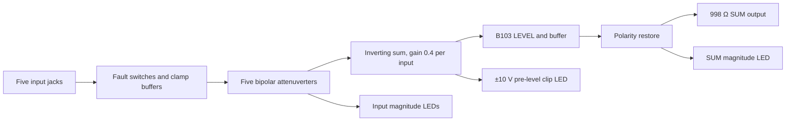

> **Unvalidated draft — not bench tested.** The generated schematic is a connectivity capture. Source values, headroom, stability, tolerances, protection and calibration need hardware review before qualification or fabrication.

M5A and M5B share `schematic/sheets/mix5.kicad_sch`. Each instance binds the six locked jacks, six locked controls and seven locked LEDs exactly once. The five audio jacks each pass an ADG5412FBRUZ source-facing fault switch, clamp, high-impedance buffer, remote buffer and B103 bipolar attenuverter. Each magnitude LED monitors its attenuverted input. None of the fixed panel coordinates move. Active roles use OSC-ES-1 OPA4196IDR for audio/CV/indicator stages, OPA4197IPWR for the local precision reference, and LM393BIDR for the clip window. Exact package and pin identities come from the retained library evidence; non-shortlist passive values keep blank MPN fields until sourced.

| Net | Connected pins/functions | Value / note |
| --- | --- | --- |
| `n_TIP` | Locked jack tip to ADG switch source | `n=1..5`; jack switch `TN` unused. |
| `n_PROTECTED` | ADG drain to 100 kΩ protected input/clamp | Source-facing power-off isolation. |
| `n_GAIN` | B103 attenuverter output to 100 kΩ summer input and magnitude monitor | Nominal −1..+1 gain; loading/tolerance open. |
| `SUM_NODE` | Five 100 kΩ inputs and 40 kΩ feedback | Sensitive local virtual ground; no connector. |
| `SUM_PRELEVEL` | Summer output, clip monitor and LEVEL remote buffer | Clip is independent of LEVEL. |
| `LEVEL_BUFFERED` | B103 wiper buffer to 100 kΩ polarity-restorer input | Passive level after sum. |
| `SUM_POSTLEVEL` | 100 kΩ feedback restorer to output and magnitude cell | Nominal 0..1 manual gain after polarity restore. |

**Design choice:** 40 kΩ feedback uses the ±10 V pre-level window at five coherent ±5 V inputs. An automatic 1/5 average would hide gain intent; a unity summer would demand ±25 V outside the ±12 V rails. DC coupling preserves static CV mixing. The clip stage precedes LEVEL so a quiet output cannot hide the overloaded summer. The magnitude indicators follow the input gain pots so each shows the actual sum contribution. No AC coupling or downstream-only clip scheme was adopted.

| Stage | Proposal / observable consequence |
| --- | --- |
| Summer | Five 100 kΩ input resistors and 40 kΩ feedback give `SUM_PRELEVEL = -0.4 × sum(input gains)` within linear headroom. One ±5 V full-scale input gives ∓2 V. Five coherent +5 V inputs request −10 V. There is no automatic divide-by-five. |
| LEVEL | A buffered B103 passive level divider runs from pre-level sum to ground. An inverting unity stage restores output polarity after the level buffer. Fully clockwise is approximately unity from the pre-level node; midpoint is not guaranteed 50% with loading/taper tolerance. |
| SUM | The output cell buffers the restored signal and uses 998 Ω total source isolation. Magnitude LED monitors the post-level signal. |
| Clip | The ±10 V window monitors **pre-level** SUM through the standard `clip_detector`, so turning LEVEL down does not hide an internal overload. Threshold and response still need bench calibration. |

The ideal ngspice fixture drives all five inputs to +5 V with all attenuverters at +1: it computes −9.99997 V pre-level and +4.999975 V at a *linear* half-level fixture. It does not model the real pot taper, amplifier output swing, indicator loading, cables, faults or clipping. The 40 kΩ feedback resistor has no exact orderable MPN in this capture; source and tolerance must be resolved before procurement.

The per-instance current worksheet `design/reports/current/mix5.json` counts seven OPA4196 packages, one OPA4197 package, five ADG5412F packages, two LM393B packages and one REF5050 package, plus LEDs, external load and a stated resistor/reference allowance. Its per-rail planning values are **not guaranteed maxima**. There is no module-specific bulk-capacitor allocation; each IC package has local 100 nF rail bypasses.

**Islands and calibration:** `SUM_NODE` is Sensitive and remains in the local core island; the indicator drivers use a local LED island and the fixed panel pots/LEDs retain their locked placement. There is no internal calibration trim for MIX5; gain/offset qualification uses measured parts and the bench gate.

**Factory/bench gate:** sweep each input through −5/0/+5 V at attenuverter end/center positions, verify correct SUM polarity and gain for one channel and five coherent channels, confirm input indicators after their pots, test clip onset before LEVEL attenuation, and check output short/recovery and cable stability with the selected op-amp. Record rail currents at temperature and during startup/faults. The oscillator precision-output ideal model failed its overshoot target elsewhere in this proposal, so these mixer output buffers have no inherited stability pass.
