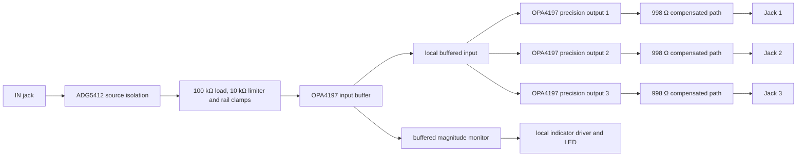

> **Unvalidated draft — not bench tested.** B1 and B2 are generated from one family specification. The topology follows the handoff and OSC-ES-1; no built board, fit, pitch accuracy, overload behavior or output stability has been demonstrated.

## Function and signal path

Each of the two modules accepts one input and provides three independent buffered copies. The design uses one OPA4197 quad per module: one channel for the protected high-impedance input and one compensated precision output channel per jack. Input and output jack switch contacts are explicitly left unused.

`design/spec/modules/mult.py` is the source for the generated `mult` sheet, instantiated as B1 (index 31) and B2 (index 32). The handoff calls the functional sheet `61_mult`; the generator's source sheet is `schematic/sheets/mult.kicad_sch`.

## Electrical targets and error budget

| Property | Captured value or calculation | Status |
| --- | --- | --- |
| Input load | 100 kΩ nominal to AGND, followed by 10 kΩ series limiting and rail clamps | Source impedance and clamp leakage effects open |
| Nominal linear input range | −5 V to +5 V | Project target; not measured |
| Survival input range | ±12 V continuous fault planning | Survival is not a linear operating range; isolation and clamp tests open |
| Output topology | OPA4197; 2 × 499 Ω / 0.5 W in series, with 100 Ω DC feedback from the jack and 1 nF local high-frequency feedback | OSC-ES-1 proposal; 12/12 TI-model cases pass, physical checks open |
| Load-induced change | ≤1 mV from open circuit to 10 kΩ at −5 V, 0 V and +5 V | Required bench target; stability and load response unverified |
| Datasheet offset reference | OPA4197 input offset maximum ±100 µV at the datasheet's stated ±18 V, 25 °C conditions | Conditions differ from the project's ±12 V rails; not promoted as a project guarantee |
| Two-amplifier offset estimate | 100 µV input buffer + 100 µV output channel = 200 µV worst-direction sum | Planning arithmetic only; bias-current contribution requires a net-by-net impedance calculation with the revised 100 Ω feedback path. Source impedance, switch on-resistance, clamp leakage, resistor tolerance and temperature are excluded. |
| Output load target as fractional error | 1 mV / 5 V = 200 ppm = 0.02% at the ±5 V test point | Target, not a measured gain error |
| 1 V/octave pitch conversion | 1 mV ≈ 1.2 cents; the 1 mV load target is ≈1.2 cents. Adding only the 0.2 mV preliminary offset estimate gives ≈1.44 cents | Arithmetic at 1 V/octave; excludes bias, tolerance and source effects and does not establish tracking or an accuracy limit |

The multiplication output paths use OSC-ES-1's compensated precision cell. The 998 Ω resistance is outside the local amplifier drive node but inside the DC feedback loop through the jack; the 1 nF capacitor supplies a separate local high-frequency path. A plain output resistor outside feedback would attenuate a 10 kΩ load. The project has no per-output gain trim. The 100 Ω and 1 nF exact passive identities remain open.

### Main nets

| Net | Connected pins | Value / note |
| --- | --- | --- |
| `IN_TIP` | `J_IN.T`; input `ADG5412` source pin 3 | Patch source-facing node; jack normal is NC |
| `IN_PROTECTED` | Input isolation switch drain pin 2; `R_PD.1`; `R_LIMIT.1` | Local protected node; `R_PD` is 100 kΩ to AGND |
| `IN_SENSE` | `R_LIMIT.2`; clamp bridge midpoint pin 3; OPA4197 quad pin 3 (input-buffer non-inverting input) | High-impedance, clamped amplifier input; local only |
| `IN_BUFFER` | OPA4197 quad pin 1 (input-buffer output), pins 5/10/12 (three output-channel non-inverting inputs), and magnitude-driver monitor input | Buffered source distributed only within this module |
| `OUT_n_TIP` | Output channel jack pin through its two 499 Ω resistors; its 100 Ω feedback resistor; `J_OUT_n.T` | `n` is 1, 2 or 3; load target is checked here |
| `+12V`, `-12V`, `+5V`, `AGND` | IC supplies, protection cells and analog returns | Only family global nets; all signal nets remain local per sheet instance |

## Decisions and provenance

- **From the R21 handoff:** two 1-to-3 multiples, one input, three independently buffered outputs. The earlier four-output interpretation was rejected because it does not match the locked panel.
- **From OSC-ES-1:** use the source-facing ADG5412 protection cell, the 100 kΩ input load, precision amplifier role and compensated output network. A naked clamp connected to the external jack was rejected because it cannot provide powered-off isolation.
- **Captured for this module:** assign all four OPA4197 channels to the input and three outputs. The unused fifth/power unit and internal package pins are generated from the library symbol; one OPA4196 indicator-driver channel is included on the LED island.
- **Not assumed:** no source impedance, external load beyond the stated 10 kΩ test point, power sequencing, rail fault behavior or panel fit is certified. Existing lockfile coordinates and jack references are used without movement.

## Calibration, islands and verification

There are no adjustment components. Factory characterization should measure the input-to-output transfer at −5 V, 0 V and +5 V, separately for each output, at no load, 100 kΩ and 10 kΩ. Record DC offset, the open-to-10 kΩ change, the 1 V/octave error in cents, output settling and oscillation/ringing. Also test one-output shorts, paired outputs at opposite polarities, input ±12 V fault conditions, missing rails, startup, temperature and LED brightness. These are open bench gates, not completed tests.

- `IO_JACK:${SHEETNAME}` contains protection, the input buffer, all three precision outputs and their compensation parts.
- `IO_JACK:${SHEETNAME}` contains the indicator driver and the locked `L:<instance>.IN.mag` LED. Only the already-buffered `IN_BUFFER` monitor and analog return may cross to that indicator island.
- `IN_PROTECTED` and `IN_SENSE` are sensitive local nets. Neither is global or exposed to a panel control.
- The panel references are resolved from the lockfile: B1 uses J109/J209/J110/J210 and D109; B2 uses J309/J409/J310/J410 and D309. No coordinate or placement was changed.

The current worksheet at `design/reports/current/mult.json` estimates per-instance typical current as 5.86 mA on +12 V, 5.46 mA on −12 V and 0.05 mA on +5 V; planning maxima are 11.05 mA, 10.45 mA and 0.075 mA. These are not guaranteed limits; fault/clamp current, simultaneous output shorts, temperature and capacitive loads remain unquantified. OPA4197 does not have a retained usable vendor simulation model in this project, so module simulation is **NOT RUN** for that reason, as recorded in `design/reports/spice/mult.json`. KiCad ERC and exported-netlist checks cover capture connectivity only; they do not prove performance or hardware safety.

## Source I/O allocation

[Issue #60's source partition](./osc-io-partition.mdx) assigns raw jack, input isolation/clamp, local output feedback and magnitude drivers to the jack region, with complete fitted packages and local bypasses. The generated manifest is the current allocation authority; earlier broad module-island descriptions above describe the logical circuit grouping. Only checked buffered signals, conditioned logic, references, permitted wipers, and power/AGND are candidate connector nets. Physical boards and connector loads remain #35 work; this is an unvalidated draft.
