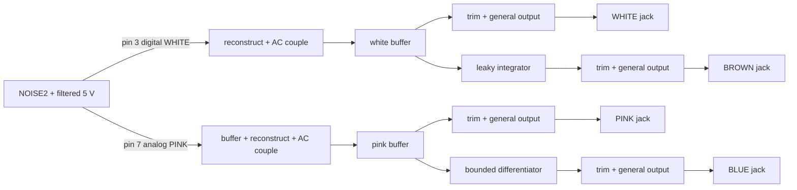

> **Unvalidated draft — not bench tested.** This is a proposed circuit capture, not a production schematic, qualified module or fabrication release.

N1 occupies the four locked `J:N1.WHITE`, `J:N1.PINK`, `J:N1.BLUE` and `J:N1.BROWN` jacks. There are no controls or indicators. The R21 handoff calls for four separately buffered colours from a NOISE2 candidate. The retained NOISE2 manufacturer sheet (`circuit/sources/ic-library/NOISE2.pdf`) identifies pin 3 as digital white pulses at roughly 100 kHz and pin 7 as a low-drive, four-bit analog pink output. It describes separate white and pink algorithms within one device. Blue is shaped from pink and brown from white here; **the four jacks are not four independent random generators**.

## Captured nets and values

| Net | Connected pins | Value / note |
| --- | --- | --- |
| `NOISE_VDD` | NOISE2 pin 1, 22 Ω feed from +5 V, 4.7 µF + two 100 nF local decouplers | Digital supply island; pin 8 and unused digital inputs 2/4/5/6 go to AGND. PWR_FLAG declares only this filtered local rail. |
| `WHITE_RAW` | NOISE2 pin 3 → 1 kΩ / 10 nF reconstruction → 100 nF series / 100 kΩ bleed | Digital 0–5 V pulses are reconstructed and DC blocked before the analog buffer. |
| `PINK_RAW` | NOISE2 pin 7 → high-impedance follower → 1 kΩ / 10 nF → 100 nF series / 100 kΩ bleed | Pink DAC is buffered before any significant load. |
| `WHITE_SIGNAL`, `PINK_SIGNAL` | AC-coupled buffers, their own level channels, and one derivative path each | No patch normal or hidden connection between modules. |
| `BROWN_SHAPE` | WHITE_SIGNAL → 100 kΩ input; 1 MΩ parallel 10 nF feedback | Leaky inverting integrator. Feedback knee 15.9 Hz; no ideal unbounded DC integration. |
| `BLUE_SHAPE` | PINK_SIGNAL → series 100 pF / 100 kΩ; 100 kΩ parallel 33 pF feedback | Differentiator input knee 15.9 kHz, feedback knee 48.2 kHz. The inherited reconstruction pole also limits high-frequency drive. The small capacitances demand physical stability testing. |
| `*_LEVEL`, `*_TIP` | Each shaping net → its own gain trim, OPA4196 channel, general output cell and panel jack | Four independent output drivers; two 499 Ω isolation resistors per standard output. BLUE uses 10× nominal level gain, BROWN 5×, WHITE/PINK 1×, with a 10 kΩ trim in each feedback path. |

The source and its supply bypass belong to `NOISE_DIGITAL`; the analog shapers and output cells belong to `NOISE_ANALOG`. Keep the raw clock edges, `WHITE_RAW`, `PINK_RAW`, the small blue capacitors and the brown feedback loop local. The output jacks may be on a remote board only through the standard protected output interface; no storage node is a connector signal. Every part carries `Block`, `Role`, `MPN`, `Manufacturer`, `LCSC` and `Island` attributes. Exact passive values with no demonstrated orderable identity retain an empty MPN.

These choices keep the digital white pulses off a patch jack, avoid loading the low-drive pink DAC, and give brown a resistive DC leakage path. Direct digital-white output, a free-running ideal integrator, and four separate random-source ICs were rejected for this draft. A higher-order reconstruction filter and active output servo were deferred until source spectra, offset and board area are measured; neither would be justified by the current evidence. OPA4196 is the standard audio role because this is an audio source, not a precision pitch-CV path.

## Spectral choice and model evidence

A 100 nF / 100 kΩ AC coupling knee of 15.9 Hz removes the source's 0–5 V mean; 1 kΩ / 10 nF reconstruction rolls off around 15.9 kHz. These are proposed values. The NOISE2 manufacturer calls its own white and pink spectra approximately flat and −3 dB/octave across audio, with 2–3 dB variation; our model does **not** simulate that device spectrum. Pink output drive is unknown until measured. The blue differentiator adds about +6 dB/octave from pink over the declared 100 Hz–5 kHz model band, giving a target net blue tilt near +3 dB/octave if the source behaves as stated. The brown integrator adds about −6 dB/octave from white over 100 Hz–5 kHz.

| Path | Proposed useful band | Ideal-opamp AC model slope | Finite limits |
| --- | --- | --- | --- |
| WHITE | 20 Hz–15 kHz | −0.443 dB/dec, 100 Hz–8 kHz | 15.9 Hz coupling high pass; 15.9 kHz reconstruction low pass. |
| PINK | 20 Hz–15 kHz | −0.443 dB/dec, 100 Hz–8 kHz | Same analog band; NOISE2's pink source slope is additional and unmodeled. |
| BROWN | 20 Hz–5 kHz | −20.110 dB/dec, 100 Hz–5 kHz | 15.9 Hz leaky feedback knee and upstream 15.9 kHz low pass. |
| BLUE | 100 Hz–5 kHz | +19.557 dB/dec, 100 Hz–5 kHz | Input differentiation bends at 15.9 kHz, feedback at 48.2 kHz and upstream source at 15.9 kHz. |

The four ngspice AC decks (`design/spec/modules/spice/noise-*-ac.cir`) run through the pinned KiCad oracle; `design/reports/spice/noise.json` records all four sweeps and sampled gains. Ideal op-amp gain and a flat AC input are model fixtures. No RMS noise, waveform, clipping, clock-feedthrough, device DAC artifacts, physical pole tolerance or stability result is inferred from them.

**Level target:** equal integrated RMS at the four jacks over 20 Hz–20 kHz, rather than equal peak. Noise peaks vary stochastically, so peak matching would be sensitive to observation time. The nominal gain choices above and four factory trimmers are starting values only. With unknown NOISE2 output PSD, pink DAC amplitude and capacitor tolerance, equal RMS cannot yet be claimed; the factory procedure must measure weighted/unweighted RMS, change resistor options if trim range is insufficient, then verify ±5 V nominal swing and overload recovery into specified loads. A shorted jack remains a fault test, not a normal level target.

**Brown DC:** the AC coupling rejects a settled 2.5 V digital mean and the 1 MΩ shunt stops ideal integrator drift. For an illustrative room-temperature component model using OPA4196's ±100 µV offset and ±20 pA bias figures from its retained PDF, the two-stage output offset contribution is on the order of 7 mV plus `5.5 MΩ × |Ileak|` from the coupling capacitor, before drift, mismatch and any source transient. The data-sheet figures are specified at test supplies, not a qualified ±12 V module bound. Capacitor insulation/leakage, humidity, offset at operating supply/temperature and switch-on settling have no established limits here; **a guaranteed total DC bound is open**. Measure it at both cold and hot start and after long dwell. No DC or runaway guarantee follows from the ideal AC deck.

**Digital supply:** 22 Ω plus 4.7 µF creates an illustrative 1.54 kHz supply pole (and local 100 nF handles faster edges). At the provisional 10 mA planning allowance, the feed loses 0.22 V. Actual NOISE2 current, minimum VDD, rail impedance and 100 kHz clock contamination are unmeasured. The +5 V worksheet is an allowance, not a manufacturer maximum. Analog supply planning is +12 V 6 mA and −12 V 6 mA per N1; +5 V allowance is 10 mA. `design/reports/current/noise.json` counts whole quad packages and four output loads. Guaranteed rail maxima remain null until device, signal and fault loads are bounded.

## Assembly, calibration and gates

NOISE2 is maker-programmed and has no confirmed factory order code. The proposed factory-only soldering route is a factory-soldered PDIP-8 socket, followed by insertion of the programmed part. `design/standard/sourcing-risks.json` records that factory acceptance of an empty socket, consignment/insertion, retention and final electrical test are unconfirmed. Direct hand-soldering is outside the owner's assembly constraint.

At bench: confirm pin 1 filtered VDD under startup and steady load; scope white clock and pink DAC at the device and after filtering; measure clock contamination on +5 V and ±12 V; sweep each analog filter and compare poles/slopes; calibrate four integrated RMS levels with a defined bandwidth and load; measure output DC after thermal dwell; inspect blue amplifier noise/phase margin with real parasitics and cable capacitance; test output isolation, power-off patching, short recovery and factory socket retention. No calibration point has been assigned a released acceptance tolerance. The panel/PCB partition and physical fit remain open, as does the whole-instrument rail ceiling in #33/#34.
