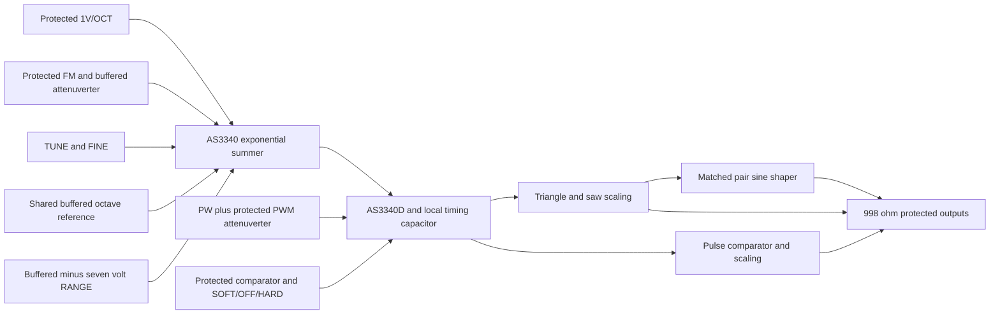

> **Unvalidated draft — not bench tested.** O1–O5 are five instances of one generated family. Replication happened without validating a physical oscillator. There is no tracking, distortion, startup or factory-sourcing qualification.

The fixed handoff supplies eight jacks and eight controls per oscillator, with no indicators. Issue #29 supplies the circuit decisions below under **PROPOSAL (planning, owner-delegated)** and follows [OSC-ES-1](./osc-electrical-standard.mdx). The source is `design/spec/modules/oscillator.py`; generated sheets are `schematic/sheets/oscillator.kicad_sch` and `octave_reference.kicad_sch`. All 80 oscillator panel UIDs bind to the placement lock exactly once. Instance indices 11–15 belong to O1–O5; index 16 belongs to the shared reference.

## Manufacturer evidence and supply choice

The retained [ALFA manufacturer PDF](https://www.alfatriode.lv/eng/sc/AS3340.pdf) is revision **2020 v7, 08-Sep-2020**, SHA-256 `66108a3ddcc78a158d66974a497801ce6a429d465b338f6c8d656fd7ddce815e`. Its headers identify ALFA RPAR and the publisher domain. Printed pages 1 and 6 identify **AS3340D, SOIC-16**; the page 2 PDIP-16/SOIC-16 table establishes all sixteen pins. The file is retained at `circuit/sources/ic-library/AS3340.pdf`, with audited pin evidence in `design/standard/pin-maps/vco.json`. This supersedes the earlier unavailable-source state for this exact part. It does not confirm factory stock.

The document recommends externally supplied −5 V to reduce self-heating. Its internal 7.4 V zener description conflicts with the page 3 absolute limit of −6 V between VEE and ground. The draft therefore replaces the planning series resistor into the internal zener with a **local OPA4197 VEE driver fed by LOCAL_REFN5**, itself buffered from the shared −5 V reference by the [local fanout stage](./osc-reference-fanout.mdx), using 100 Ω isolation, 10 kΩ sense feedback and 100 pF local feedback. VEE bypasses to ground with 100 nF. The buffer must sink the core's negative-supply current; the current worksheet charges this to −12 V. This is a proposed supply circuit, requiring load, stability and rail-sequencing tests. The source's startup statement about its core does not validate this complete instrument.

The intended steady operating state requires all three instrument rails. With +12 V absent, or −12 V absent, reference and amplifier operation is outside the selected normal supply condition; oscillator output levels and VEE5 are not guaranteed. +5 V absent disables input-switch enable and invalidates sync logic. No startup mute or rail-order-independent output is claimed. Test each rail first/last, slow ramps and brownouts while monitoring VEE5 against the core limit; a failed sequence requires a reviewed supply/enable change before hardware use.

No external temperature-coefficient resistor is added: the core has internal compensation. Scale1 uses 24 kΩ plus a 10 kΩ trimmer; Scale2 uses 5.72 kΩ, following the explanatory diagram on printed page 5 rather than its rounded 5.6 kΩ illustration on page 2. A 1.5 kΩ plus 1 kΩ trimmer sets scale. The high-frequency trim is 20 kΩ between pin 7 and ground, with wiper to pin 13. The linear-reference resistor changes from 1.5 MΩ at 15 V to **1.2 MΩ at 12 V**, preserving the illustrative 10 µA reference current. These are adaptations of a reference topology, not performance guarantees at the new operating point.

## Controls and frequency decisions

| Function | Chosen draft | Reason and rejected alternative |
| --- | --- | --- |
| 1V/OCT | Protected 100 kΩ input, precision buffer, then 100 kΩ / 0.1% into pin 15 | Retains one volt per octave as the calibration target; a bare jack-to-summer resistor does not provide the required power-off isolation. |
| Octave | One shared reference, six buffered −2…+3 V taps, local selected-tap receiver and 100 kΩ into pin 15 | Reduces independent reference errors and current; five separate ladders were rejected. See [octave reference](./osc-octave-reference.mdx). |
| TUNE | B104 100 kΩ between ±5 V; precision wiper buffer, 250 kΩ pitch feed | Nominal ±2 octaves. |
| FINE | B104 100 kΩ between ±5 V; precision wiper buffer, 5 MΩ pitch feed | Nominal ±0.1 octave, or ±120 cents. |
| FM | Protected input and B103 10 kΩ buffered bipolar attenuverter; 200 kΩ pitch feed | Exponential FM, up to ±2.5 octave command at ±5 V and full depth. Linear FM was rejected for this panel's first draft. No through-zero operation. |
| RANGE | Two-position switch selects a buffered −7 V offset or ground; 100 kΩ pitch feed | LFO divides the ideal command frequency by 128. The timing capacitor never travels to the panel switch. Open contact tends to VCO through 10 MΩ. |
| Timing | 1 nF C0G at pin 11, local to the core | Preserves the reference topology. No switched timing capacitor or remote timing wire. |
| Base calibration | +5 V through 82.5 kΩ, plus a 10 kΩ trimmer across ±5 V feeding through 1 MΩ | Nominal calibration point is 65.406391 Hz with zero external pitch/FM, OCT 0, centred TUNE/FINE and VCO selected. This is a target, not a predicted untrimmed frequency. |

After ideal calibration, the **command relationship** is `f = 65.406391 × 2^(PITCH + OCT + 0.4×TUNE + 0.02×FINE + 0.5×FM_DEPTH − 7×LFO)` in hertz, with voltage terms measured at the corresponding buffers. It is not a manufacturer core model.

With pitch/FM unpatched, the octave/tune/fine controls command approximately 3.814…2243 Hz in VCO and 0.0298…17.52 Hz in LFO. External pitch and FM can command values beyond the core's useful range. The intended characterization envelope is **0.015…20,000 Hz**; there is no claimed electrical hard limiter at 20 kHz, no guaranteed minimum frequency, and no promised tracking beyond measured results. Below the target range, leakage and long periods must be characterized; above it, core current limits and shaping bandwidth may dominate.

## PWM and synchronization

PW is a B104 100 kΩ DC-source pot from 0 to +5 V. Its buffered voltage and the PWM attenuverter are summed as `0.2 + 0.72×PW + 0.36×PWM_DEPTH`. An inverting summer uses 72 kΩ feedback with 100 kΩ, 200 kΩ and 1.8 MΩ inputs; a unity inverter restores polarity. A 10 kΩ limiter and BAT54S clamp to ground and buffered +4 V bound the core pin near that range. Schottky drops and the core's input current alter the endpoints. Nominal manual control targets roughly 5…95% duty for an inferred 4 V triangle; modulation may reach constant-high/constant-low output. No minimum pulse width is guaranteed.

SYNC receives the standard protected input and hysteretic comparator, powered from +12 V/GND with 5 V logic output. The three-position panel switch routes that conditioned waveform to SOFT, nowhere, or HARD. Each throw has a 100 kΩ pulldown, 10 kΩ series limiter and **1 nF AC coupling** to core pin 9 or 6. OFF leaves both external drive nodes at zero.

This coupling passes **both transitions** of the conditioned waveform, so the initial hard-sync proposal allows positive and negative sync events, as illustrated by the manufacturer. It is not a rising-edge-only reset guarantee. A monostable/unipolar sync conditioner was rejected for this first capture because the manufacturer's AC-coupled topology is explicit; edge behavior and capture range remain bench gates. Changing the toggle can create an unintended edge. There is no clickless mode-change promise.

## Waveforms and sine shaping

The manufacturer waveform table is at +15 V. The draft **infers**, from the core diagram, raw triangle 0…4 V and saw 0…8 V at +12 V. Fixed scaling targets ±5 V unloaded:

| Output | Circuit and nominal relationship | Boundary |
| --- | --- | --- |
| TRI | Inverting amplifier, 40 kΩ input / 100 kΩ feedback; positive input biased from +5 V by 250 kΩ/100 kΩ. `5 − 2.5×TRI_RAW` | Inverted relative to raw triangle; amplitudes at 12 V need measurement. |
| SAW | 80 kΩ input / 100 kΩ feedback; bias divider 125 kΩ/100 kΩ. `5 − 1.25×SAW_RAW` | Falling saw relative to the raw rising saw. |
| PUL | Raw pulse divided by two; comparator against +2.5 V with 4.7 kΩ pull-up to +5 V; amplifier produces `2×LOGIC − 5` | Inverted core pulse polarity; comparator low voltage causes a small low-level error. |
| SIN | Triangle into BCM847BS matched pair, differential amplifier and adjustable inverting gain | Soft saturation approximates sine; no distortion or symmetry specification has been established. |

The sine pair uses 68 kΩ/1 kΩ triangle attenuation, a 10 kΩ common-emitter tail resistor to −12 V, and two 10 kΩ collector loads to +12 V. Four 100 kΩ resistors form a differential receiver. Its output feeds 100 kΩ into an inverting stage with **49.9 kΩ plus 10 kΩ level trim**. A separate 10 kΩ symmetry trimmer across ±5 V injects through 1 MΩ into the driven base. At 1 kHz the generic matched-BJT model gives about 9.92 Vpp, 14.6 mV mean and 2.04% THD using a 1.5 V symmetry-wiper setting and 5.5 kΩ level-rheostat setting. These are model settings and results, not measured trim positions or a product distortion specification; the transistors' actual mismatch, Early effect, temperature and capacitances are not certified by that model.

All four waveforms then use the standard general-output buffer and two 499 Ω / 0.5 W resistors. ±5 V is the unloaded target; load loss remains the standard general-output loss. No LED circuit is added.

## Important local nets

| Net | Connected pins | Value / note |
| --- | --- | --- |
| `TIMING_CAP` | AS3340 pin 11 and timing capacitor | 1 nF C0G; `Sensitive`, no connector or panel contact |
| `EXPO_SUM` | AS3340 pin 15 and pitch/octave/tune/fine/FM/range/bias resistors | `Sensitive` virtual-ground control node |
| `SCALE1`, `SCALE2` | AS3340 pins 1, 2 and compensation resistors | Local compensation and factory probe points |
| `SCALE_PIN` | AS3340 pin 14, scale network, 100 nF | Local scale calibration |
| `LINEAR_REF` | AS3340 pin 13, 1.2 MΩ reference, HF wiper, 470 Ω/10 nF branch | No user linear-FM jack |
| `HF_PIN` | AS3340 pin 7 and high-frequency trimmer | Local tracking correction |
| `VEE5` | AS3340 pin 3, local buffer sense and bypass | Proposed regulated −5 V; local power flag describes the active driver, not measured power qualification |
| `PWM_PIN` | AS3340 pin 5, 10 kΩ limiter and clamp midpoint | Bounded PWM command |
| `HARD_PIN`, `SOFT_PIN` | AS3340 pins 6 and 9, respective 1 nF coupling caps | Edge injection local to core |
| `TRI_RAW`, `SAW_RAW`, `PULSE_RAW` | AS3340 pins 10, 8 and 4 | Internal waveforms, never jack tips directly |
| `OCT_SELECTED` | Rotary common pins 1 and 10, local 1 kΩ receiver resistor | Only buffered tap voltages on panel wiring |

The timing and processing circuitry remains in `OSC_CORE:${SHEETNAME}`, while jack I/O is in `IO_JACK:${SHEETNAME}`; timing, compensation and summing nodes are additionally sensitive. Panel contacts and pots are outside that island and carry buffered signals, references, return or high-impedance wipers. The actual board partition must preserve these local nets. Every IC supply pin has local 100 nF decoupling. No per-oscillator bulk capacitor is automatically added; the later board capacitor ledger owns bulk allocation.

## Calibration without soldering

There are six trimmers per oscillator, plus the shared octave-span trimmer. All are factory populated and accessible for adjustment; an owner may adjust them without soldering.

1. Verify +12/−12/+5 V and buffered VEE5 under load before applying calibration signals. Warm for 20 minutes; record temperature, references, supply currents and instruments.
2. Calibrate and record all six shared octave taps. Set each channel to VCO, OCT 0, TUNE/FINE centre, FM/PWM depth centre and approximately 50% pulse width.
3. Adjust the Scale1 compensation trimmer against the Scale2 current using high-impedance measurements of their resistor drops. This establishes the reference circuit's nominal current balance; confirm thermal behavior afterwards.
4. Set the base-frequency trimmer near 65.406391 Hz. Apply accurately measured 0 and +1 V to pitch and adjust the scale trimmer for a 2:1 ratio. Repeat base and scale adjustment because they interact.
5. Sweep pitch and octave settings up toward 16–20 kHz and adjust the HF trimmer. Repeat the low-frequency checks and record every measured point. Failure to meet a target leaves a gate open; it does not authorize a tracking claim.
6. With triangle verified, adjust sine symmetry for minimal DC/even-harmonic asymmetry, then sine level for approximately 10 Vpp. Repeat at several frequencies and loads. Record the fixed triangle/saw scaling and pulse endpoints; a failed scaling assumption requires a reviewed circuit revision at the factory.

The standard's 2 mV octave-step and five-cent tracking figures remain **targets**. Five cents at 1 V/oct is about 4.167 mV equivalent error, shared among the reference, pitch path and core. Individual 0.1% resistors alone cannot establish it.

## Verification and remaining gates

The generated master passes pinned KiCad 10 ERC with zero errors; oscillator and octave sheets introduce zero warnings. Other module warnings are tracked in the master ERC baseline; this paragraph describes the retained native check, not a new whole-master run. Exported netlist parity checks every component pin. Contract tests cover bindings, pin evidence, local timing, input isolation, real ladder endpoint connections, range/pitch ratios, transistor wiring and complete amplifier packages.

`design/reports/spice/oscillator.json` records the exact model-limited results. Shared reference, waveform scaling and generic-pair shaping are exercised through the pinned ngspice runner during canonical regeneration. The sine fixture selects twelve signal-path resistors and two amplifier connections by source role; its symmetry wiper is imposed at 1.5 V and its level rheostat at 5.5 kΩ. The SINE_REF5/REFN5 fanout and actual symmetry-pot loading are excluded from this fixture. The separate [local-reference fanout report](./osc-reference-fanout.mdx) owns the nominal vendor-buffer model and its limits. The AS3340 core, sync behavior, temperature, V/oct tracking, startup, real amplifier stability and fault protection are **NOT RUN** because those retained models do not establish those behaviors.

{/* oscillator-current:start */}

Current captured population from `design/reports/current/oscillator.json`; whole packages, including unused powered channels, are counted.

Per `oscillator` instance (O1, O2, O3, O4, O5): 4 `ADG5412FBRUZ`, 1 `AS3340D`, 2 `LM393BIDR`, 6 `OPA4196IDR`, 4 `OPA4197IPWR`, 1 `SN74HC14DR`.

Per `octave_reference` instance (OCTAVE_REF): 3 `OPA4197IPWR`, 1 `REF5050AIDR`.

Combined planning upper subtotals (+12 / −12 / +5 mA): **339.500 / 335.000 / 30.000**. These are rounded planning allowances, not measured or guaranteed maxima.

Complete guaranteed maxima (+12 / −12 / +5 mA): **NOT ESTABLISHED / NOT ESTABLISHED / NOT ESTABLISHED**. Core source conditions, dynamic/temperature loads and faults remain qualification gates.

{/* oscillator-current:end */}

Before hardware approval: resolve AS3340D factory sourcing, exact value-specific passive MPNs, the buffered negative supply under every rail sequence, thermal drift, frequency coverage, actual 12 V waveform levels, sine distortion, PWM endpoints, both sync modes, octave bounce, harness stability and output faults. No physical oscillator, factory assembly or complete supply budget has passed here.

## Source I/O allocation

[Issue #60's source partition](./osc-io-partition.mdx) assigns raw jack, input isolation/clamp, local output feedback and magnitude drivers to the jack region, with complete fitted packages and local bypasses. The generated manifest is the current allocation authority; earlier broad module-island descriptions above describe the logical circuit grouping. Only checked buffered signals, conditioned logic, references, permitted wipers, and power/AGND are candidate connector nets. Physical boards and connector loads remain #35 work; this is an unvalidated draft.
