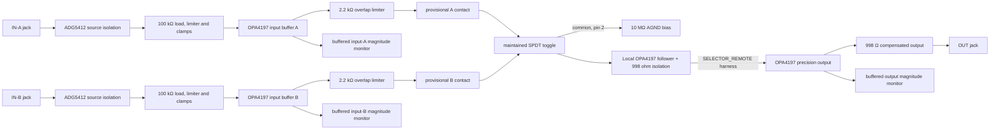

> **Unvalidated draft — not bench tested.** X1 and X2 are two instances of one generated family. The selector is maintained and manual. Switching clicks are accepted; click-free behavior is not claimed. No board, physical switch orientation, fit or analog performance has been verified.

## Function and signal path

Each source is isolated and buffered before it reaches the panel toggle. Separate 2.2 kΩ resistors limit current if both contacts overlap. A 10 MΩ resistor biases the switch common to AGND during a break-before-make gap. The common drives a local OPA4197 unity follower and two 499 Ω isolation resistors. Its buffered `SELECTOR_REMOTE` net drives the precision output cell on the jack region. This is a two-position A/B selector, not a crossfader or a sequential/clocked switch.

`design/spec/modules/manual_ab.py` is the source for generated sheet `manual_ab`, instantiated as X1 (index 33) and X2 (index 34). The handoff's functional section is named `64_manual_ab`; the generated source sheet is `schematic/sheets/manual_ab.kicad_sch`.

## Electrical targets and selector limits

| Property | Captured value or calculation | Status |
| --- | --- | --- |
| Input protection | One source-facing ADG5412 channel, 100 kΩ input load, 10 kΩ limiter and rail clamps per input | OSC-ES-1 proposal; input source impedance and fault behavior open |
| Input and output amplifiers | OPA4197 precision role; two input buffers, one local harness driver and one output buffer occupy two whole quads, separated by board region | C2057327 identity inherited; current stock unverified; 24-case retained TI-model path screening; hardware remains unqualified |
| Overlap limiting | 2 × 2.2 kΩ between input buffers and toggle throws | If the buffered signals are +5 V and −5 V, resistor-only overlap current is 10 V / 4.4 kΩ ≈ 2.27 mA. This calculation does not establish switch contact or amplifier ratings. |
| Survival-voltage arithmetic | Opposing ±12 V difference across 4.4 kΩ is 24 V / 4.4 kΩ ≈ 5.45 mA | Arithmetic only; ±12 V is a fault-survival condition, not a linear signal range or a continuous operating guarantee |
| Mid-throw bias | 10 MΩ from toggle common to AGND | Prevents an intentionally floating amplifier input; resistor exact MPN is unresolved |
| Bias-related signal loss | `10 MΩ / (10 MΩ + 2.2 kΩ) ≈ 0.99978`; about 1.1 mV at 5 V (0.022%) | Nominal resistor arithmetic; no tolerance or source error included |
| Precision output load target | ≤1 mV change open-to-10 kΩ at −5 V, 0 V and +5 V | OSC-ES-1 bench target; stability and load behavior unverified |
| Preliminary 1 V/octave error arithmetic | Two OPA4197 channels at 100 µV offset each + about 1.1 mV selector bias loss + 1 mV output-load target ≈ 2.3 mV, or ≈2.76 cents | Offset values use the datasheet's ±18 V, 25 °C conditions, not the project's ±12 V. Incomplete planning estimate, not a tolerance or tracking guarantee; ignores source impedance, switch on-resistance, clamp leakage, resistor tolerance and temperature |

The 2.2 kΩ values and 10 MΩ common bias are design choices for this capture, not exact sourced orderable identities. The series resistors reduce source-to-source current if the switch bridges both throws. The bias resistor gives the output buffer a defined DC input between contacts, with a small calculated attenuation. A factory test must decide whether this loss and any source impedance are acceptable for the actual signal use.

## Panel toggle identity and provisional contacts

The lockfile assigns `C:X1.SELECT` to SW608 at `(99.5, 283.0) mm` and `C:X2.SELECT` to SW708 at `(116.5, 283.0) mm`. Their corresponding jacks remain at columns 7–9. The toggle coordinates are intentionally away from the jack columns and are not moved by this circuit capture.

| Toggle pin | Captured net | Evidence status |
| --- | --- | --- |
| 2 | `SELECTOR_COMMON` | Provisional common assignment used by the schematic; verify on physical part |
| 3 | `SELECT_A_CONTACT` | Provisional A-side assignment; lever orientation and default continuity need a coupon test |
| 1 | `SELECT_B_CONTACT` | Provisional B-side assignment; lever orientation and default continuity need a coupon test |

The locked exact identity is Dailywell `2MS1T1B1M2QES-5` (2-position SPDT, T1 lever, B1 bushing, M2 terminals). The retained supplier listing establishes the order identity. The manufacturer-primary pin/contact drawing was unavailable in the retained evidence, so the symbol's contact-side labels are not promoted as manufacturer-confirmed facts. A continuity coupon must confirm pin 2 common, which throw closes in each lever position, mechanical detents and the desired A-default before panel wiring. Do not substitute the three-position `2MS3` suffix.

## Main nets

| Net | Connected pins | Value / note |
| --- | --- | --- |
| `A_TIP`, `B_TIP` | Each jack `T`; its source-facing ADG5412 pin 3 | External sources enter separate protected paths; each jack normal remains NC |
| `A_PROTECTED`, `B_PROTECTED` | Corresponding ADG5412 drain pin 2; high-impedance input `R_PD.1` and `R_LIMIT.1` | Local, protected input nodes |
| `A_SENSE`, `B_SENSE` | Corresponding `R_LIMIT.2`; clamp bridge midpoint pin 3; allocated OPA4197 input-buffer non-inverting pins | High-impedance inputs; not routed through the panel toggle |
| `A_BUFFER`, `B_BUFFER` | allocated OPA4197 input-buffer output pins; corresponding 2.2 kΩ series resistor and input magnitude-driver monitor | Buffered signals only feed the panel contacts and local magnitude monitors |
| `SELECT_A_CONTACT`, `SELECT_B_CONTACT` | Series resistor terminal 2; provisional toggle pins 3 and 1 respectively | Contact-side mapping remains unverified |
| `SELECTOR_COMMON` | Toggle pin 2 provisionally; 10 MΩ bias resistor; local harness-buffer non-inverting input | Sensitive local node, held toward AGND during a contact gap |
| `SELECTOR_REMOTE` | Local follower, two series 499 Ω resistors, and jack-region precision receiver | Buffered internal harness; ≤300 mm and ≤1 nF design envelope; not an exposed output |
| `OUT_BUFFERED` | Allocated precision-output OPA4197 output pin; output compensation network drive; output magnitude-driver monitor | Buffered node; used for the third A/B magnitude display |
| `OUT_TIP` | Precision-output jack-side resistor; 100 Ω feedback resistor and 1 nF local feedback capacitor; `J_OUT.T` | Revised fixed output cell passes 12/12 TI-model load/cable cases; physical target remains open |
| `+12V`, `-12V`, `+5V`, `AGND` | Amplifiers, isolation cells and analog returns | Only global family nets; selector signal nodes stay local |

## Decisions and provenance

- **From the R21 handoff:** two manual, maintained A/B selectors with locked panel bindings and a requested default A position. The actual lever-to-contact relationship still needs physical verification.
- **From OSC-ES-1:** place source-facing ADG5412 isolation before the input limiter/clamp, buffer each input, and switch buffered signals. Routing the raw jacks to the toggle was rejected because it would place source-to-source contact overlap directly on the patch sources.
- **Captured for this module:** add 2.2 kΩ per contact path to limit overlap current, use 10 MΩ from the common to AGND, and use the compensated precision output cell. A bare switch followed by an unbuffered output was rejected because it leaves contact overlap and a mid-throw open node unmanaged.
- **Indicator routing:** all three magnitude cells read `A_BUFFER`, `B_BUFFER` or `OUT_BUFFERED`. Raw jack, protected-input and switch-contact nodes do not drive an indicator connector.
- **Clicks:** switching transients are accepted by the task. No RC crossfade or click-suppression behavior is claimed or added.

## Calibration, islands and open bench gates

There are no trim parts. Before wiring the exact switch, use a coupon to verify common/throw continuity, physical A/B orientation, detents and the owner's desired A-default. Characterize each input path at −5 V, 0 V and +5 V, then both switch positions at no load, 100 kΩ and 10 kΩ output loads. Record selector loss, DC offset, open-to-10 kΩ change, settling, contact overlap, mid-throw behavior, click amplitude, oscillation/ringing and temperature dependence. Test source-to-source limiting, each input's ±12 V fault case, missing rails, startup, one output short and contact wear. Every one of these checks remains open.

- `IO_JACK:${SHEETNAME}` owns both input protection/buffers, all three indicators, and the output feedback/isolation network with the jacks.
- `IO_CONTROL:${SHEETNAME}` owns the selector, its contact resistors/bias, and the added local follower/isolation resistors. `SELECTOR_COMMON` and both contacts remain local. Every fitted package stays whole.
- `A_PROTECTED`, `A_SENSE`, `B_PROTECTED`, `B_SENSE`, both selector contacts and `SELECTOR_COMMON` are sensitive local nets. None is global or exposed as a panel control connection.
- Exact panel references come from the lockfile: X1 uses J809/J909/J1009, SW608 and D809/D909/D1009; X2 uses J810/J910/J1010, SW708 and D810/D910/D1010. No hardware location was changed.

`design/reports/current/manual_ab.json` estimates per-instance typical current as 7.16 mA on +12 V, 6.36 mA on −12 V and 0.10 mA on +5 V; planning maxima are 13.85 mA, 12.65 mA and 0.15 mA. The planning maximum is not guaranteed; input fault current, contact overlap, simultaneous output shorts, startup, temperature and load transients remain unquantified. TI's OPAx197 model screens the shared precision-output cell, but a complete selector circuit simulation and switch-transition model are **NOT RUN**, as recorded in `design/reports/spice/manual_ab.json`. Generated schematic ERC and netlist checks establish capture consistency only, not switching performance or hardware validation.

## Issue #60 source cut and model screen

The internal driver uses the OSC-ES-1 general-output topology with the precision amplifier role and local feedback. Its identity is `internal_selector_buffer`; it does not add an exposed jack or a #59 precision-sense obligation. The original remote-buffer proposal (100 Ω isolation, 10 kΩ feedback, 100 pF local compensation) produced about 20.6% overshoot in the 1 nF internal / 1 nF external diagnostic. It was rejected; `design/reports/spice/manual-ab-rejected-remote.json` retains the failing case, reproducible with `python3 -m design.spec.modules.run_manual_ab_spice --diagnostic-original` (expected nonzero exit). The selected internal follower with two 499 Ω series resistors avoids that additional remote feedback loop while its destination remains high impedance.

`design/reports/spice/manual_ab.json` records 24 passing TI OPAx197 model cases: open/100 kΩ/10 kΩ external loads, 0/100 pF/1 nF/5 nF external cable, and 0/1 nF internal harness. Worst total static error is 1.146 mV (including the existing 2.2 kΩ/10 MΩ selector loss); settling error relative to that loaded nominal is below 0.047 mV by 400 µs, and overshoot below 7.26%. Limits remain 2 mV complete static error, 1 mV settling, 1 mV late ripple and 10% overshoot. Contact transition/bounce and physical stability remain NOT RUN.

See [the I/O source partition](./osc-io-partition.mdx) for package and connector constraints. Each instance now has two OPA4197IPWR quads; the additional package adds 6 mA planning quiescent current per analog rail and two real 100 nF bypasses.
