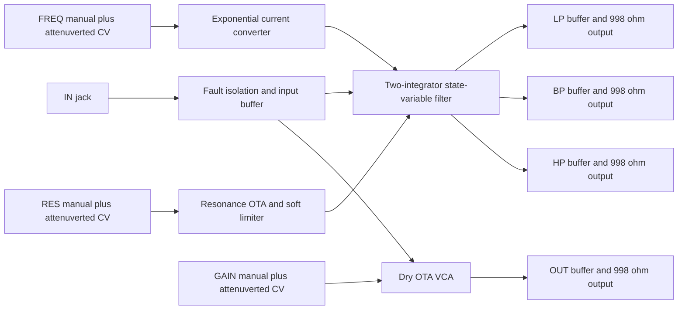

:::caution[Unvalidated draft — not bench tested]
Authority: **PROPOSAL (planning, owner-delegated)**. This is a captured design,
not measured hardware or a fabrication release. Native ERC/netlist checks and
bounded simulations establish only their stated scope. No order files exist.
:::

## G06: GAIN controls dry OUT only

**Owner confirmation remains open.** This implementation adopts the R21 baseline:
IN feeds two parallel paths. LP, BP and HP are unaffected by GAIN; OUT is an
unfiltered, voltage-controlled copy of IN. There is no internal mix or selector.
This preserves independently patchable filter outputs. Putting GAIN before the
filter would mute or change its excitation and would change that contract;
putting a VCA after each filter output would add three gain stages without a
requested function. Neither alternative is adopted.

The handoff supplies the panel contract and baseline signal paths. The topology,
values, trimming scheme and model fixtures below are engineering proposals made
for this capture. None has been verified on a board.

## Capture and electrical standard

`design/spec/modules/filter.py` is the source. It composes the established cells
and generates `schematic/sheets/filter.kicad_sch`; the root schematic instantiates
it as F1, F2 and F3. Internal index allocations are **21, 22 and 23**, recorded next
to instrument registration. Each instance binds eight jacks, six pots and four
magnitude indicators from `design/grid/placements.lock.json`: **54 UIDs total**.
Coordinates are unchanged. All jack switch contacts are unused.

OSC-ES-1 is applied: four source-facing ADG5412FBRUZ isolators, protected 100 kΩ
inputs, OPA4196IDR audio/CV/indicator roles, OPA4197IPWR precision roles, and
2 × 499 Ω / 0.5 W general output isolation. Manual FREQ/RES/GAIN pots are B104
100 kΩ; all three ± pots are buffered B103 10 kΩ. Only the four input buffers
feed indicators. General outputs deliberately use the same cell for LP/BP/HP
and OUT; no output gets a second indicator.

The four required OTA sections occupy **two LM13700M/NOPB SOIC-16 packages**.
One dual OTA cannot provide this topology. A transistor ladder was rejected
because simultaneous HP/BP/LP would require additional circuitry; a linear
cutoff control was rejected because it concentrates useful low-frequency control
into a small panel movement. TL074 is superseded by OSC-ES-1 role selection.

The capture has ten OPA4196 quads and two OPA4197 quads per filter, including
unused terminated sections. This exceeds the handoff's rough twelve-section
estimate: protection buffers, remote controls, indicators, bias servos and
reference/offset handling are now explicit. This size/current increase must be
included in board and whole-instrument planning.

## Core and signal levels

The two non-inverting OTA-capacitor integrators form a second-order SVF.
With matched integrator rate `k`, the summer implements
`HP = IN − LP − 2 BP − RES_NEG`, where `RES_NEG ≈ −g × BP`.
The small-signal denominator is `s² + (2 − g)ks + k²`; hence nominal
`Q = 1/(2 − g)` below self-oscillation. LP and HP have 12 dB/octave rejection
in their stop bands; BP has 6 dB/octave on either side.

Every OTA signal input is attenuated by **200 Ω / (100 kΩ + 200 Ω) = 1/501**.
A nominal ±5 V input therefore gives about ±10 mV OTA differential drive before
feedback resonance. This trades noise performance for a small differential
signal without a linearizing-diode bias circuit. The LM13700 diode inputs are
left open; unused Darlington inputs are grounded and outputs unconnected.
No noise, distortion or usable input-headroom figure has been measured.

LP approaches the input level at low frequencies; HP approaches it at high
frequencies. BP gain depends on Q: at low resonance its peak is about −6 dB,
while the tested high-resonance setting is about +9.7 dB. All output buffers
are unity gain. The 998 Ω series resistance adds about −0.086 dB into 100 kΩ
and −0.826 dB into 10 kΩ. Resonance can therefore drive internal nodes into
nonlinear operation with an otherwise nominal ±5 V input. Reduce input level
for highly resonant filtering; there is no constant-amplitude normalization.

Expected overload mechanisms are OTA differential-pair compression, limiter
conduction and amplifier clipping. Their order and the resulting sound remain
**NOT RUN / not listened to on hardware**. The model does not justify calling
this soft, musical or symmetric clipping. Output headroom, DC offsets, overload
recovery and cable-load stability are explicit bench gates.

### Principal nets and parts

Physical OTA pin numbers below are from the retained TI LM13700 datasheet.
Each repeated net is local to its sheet instance.

| Net | Connected pins | Value / note |
| --- | --- | --- |
| IN_BUFFER | Input buffer, HP divider, dry input divider, input indicator | Protected nominal ±5 V signal; independent parallel paths |
| HP_CORE | HP summer output, BP OTA input divider, HP output cell | Summer plus input is IN/5; feedback 100 kΩ, BP feed 50 kΩ, LP/RES feeds 100 kΩ |
| BP_INT | Integrator package pin 5, BP capacitor, BP buffer input | **Sensitive**, 150 pF C0G to AGND |
| LP_INT | Integrator package pin 12, LP capacitor, LP buffer input | **Sensitive**, 150 pF C0G to AGND |
| BP_IABC / LP_IABC | Integrator package pins 1 / 16, respective PNP collector resistor | Each bias feed has 22 kΩ series resistance |
| BP_OTA_SIGNAL / LP_OTA_SIGNAL | Integrator package pins 3 / 14 | HP/501 and BP/501 respectively; inverting pins 4 / 13 receive offset trim |
| RES_INT | Gain/resonance package pin 5, resonance TIA inverting input | Feedback 330 kΩ plus 500 kΩ trim; model fixture 573 kΩ total |
| RES_NEG | Resonance TIA output, HP summer 100 kΩ feed | Parallel limiter branch: 100 kΩ plus eight series diodes in each direction |
| RES_IABC | Gain/resonance package pin 1, 22 kΩ collector resistor | PNP emitter servo, 49.9 kΩ sense resistor, nominal 0–100.2 µA |
| DRY_INT | Gain/resonance package pin 12, dry TIA inverting input | 68.1 kΩ feedback; dry signal on pin 13, offset on pin 14 |
| DRY_IABC | Gain/resonance package pin 16, 22 kΩ collector resistor | 12.4 kΩ sense resistor; nominal 0–403.2 µA |
| EXPO_REFERENCE | BCM847BS Q1 collector pin 6, reference servo minus input | REF5 through 300 kΩ plus 50 kΩ trim; Q1 base pin 2 at AGND |
| EXPO_EMITTER | BCM847BS emitter pins 1 / 4, reference servo output | **Sensitive**, local matched-pair connection |
| EXPO_COLLECTOR | BCM847BS Q2 collector pin 3, 22 kΩ mirror-reference feed | **Sensitive**; Q2 base pin 5 receives scaled cutoff command |
| REF5 / REFN5 | Local standard reference cell, controls and offset trims | Buffered nominal ±5 V; no signal reference shared with another module |
| LP_TIP / BP_TIP / HP_TIP / OUT_TIP | Corresponding general output cell and jack tip | Four identical buffered 998 Ω output networks; jack sleeve AGND |
| +12V / −12V | LM13700 pins 11 / 6 and amplifier supplies | Local IC decoupling; rails and AGND are the only global filter nets |

All components carry the standard identity and role fields; the generator adds
`Block` and `Sensitive`. Exact ICs come from the source-backed library. Blank
procurement fields on value-selected passives are **unresolved**, not permission
to substitute. In particular, the 50 kΩ and 500 kΩ internal trim values still
need exact MPN/footprint/procurement qualification before layout is accepted.

## Cutoff law and calibration range

The cutoff command is `2 × (FREQ_MANUAL − 2.5 V) + FREQ_DEPTH`.
The attenuverter supplies nominal −1…+1 times external cutoff CV. An inverting
scale stage uses 100 kΩ input and 1.3 kΩ plus 1 kΩ trim feedback; approximately
1.8 kΩ total targets the room-temperature BJT slope of about 18 mV per octave.
The BCM847BS matched pair compares that command with a fixed reference current.
A diode-connected MMBT3906 and two further MMBT3906s mirror the resulting current
to the two integrators. The mirror parts are discrete; matching and Early-effect
error are not qualified.

With approximately 316 kΩ reference resistance, the nominal centre current is
15.8 µA. Using `gm ≈ 19.2 × IABC` and 150 pF integrators gives a centre cutoff
near 643 Hz and an ideal manual range near **20 Hz–20.6 kHz** over ten octaves.
This is a design target, not a measured endpoint. Additional CV reaches current
and headroom limits; it does not promise unlimited exponential range. The mirror
reference and both outputs have 22 kΩ resistors to bound available current.
These resistors do not establish a guaranteed fault-current limit.

**Nominal cutoff CV is 1 V/octave; pitch tracking is not claimed.** There is no
temperature compensation, precision PNP mirror or high-frequency tracking
correction. Base-current loading through the 1 kΩ base resistor, capacitor
parasitics, finite output resistance and temperature all change the response.
The 150 pF choice buys the wide range at moderate bias, at the cost of greater
sensitivity to parasitic capacitance and layout.

## Resonance and dry gain

RES and GAIN commands each sum their manual 0–5 V value with their attenuverted
CV. A resistor/BAT54S clamp and buffer limit the command approximately to the
reference range. Clamp forward voltage means these are **not exact 0/5 V bounds**.
A PNP emitter servo converts the command to current; each includes base resistance,
a 100 pF compensation capacitor and reverse base-emitter protection. Hardware
stability, settling and control feedthrough are unverified.

RES starts at nominal Q 0.5. The maximum-resonance trim sets the loop above
`g = 2`, intentionally **allowing self-oscillation at the top of the control**.
The chosen model setting is `g ≈ 2.2`. A feedback branch of 100 kΩ and eight
series signal diodes in each direction reduces incremental resonance gain when
the amplitude rises. A hard limiter was rejected because it would impose abrupt
feedback clipping; a full AGC would require a separate detector/time-constant
design. This diode arrangement has device-, temperature- and current-dependent
thresholds: no precise physical self-oscillation amplitude is specified.

The dry VCA has a nominal linear control law, approximately zero to unity for
0–5 V command. Negative command turns its bias off; positive overdrive can
exceed nominal unity until the clamp/compliance limits intervene. A **12.4 kΩ**
sense resistor limits nominal full-scale bias to 403.2 µA; **68.1 kΩ** TIA feedback
sets the model's full-scale gain close to unity. This current choice leaves
collector headroom across the 22 kΩ IABC feed, unlike an approximately 1 mA
setting. No hardware mute floor, maximum gain tolerance or feedthrough claim
is made. There is no automatic normalization of LP/BP/HP.

## Calibration and physical partition

There are **seven internal adjustments per instance**, replacing the rough
three-trimmer planning estimate: two cutoff adjustments, four OTA offset
adjustments and one maximum-resonance adjustment. These are factory adjustments,
not new panel features.

1. Verify rails/references and input/output protection with a current-limited
   supply. Check static bias currents before applying large signals.
2. With low resonance and safe temporary bias fixtures, centre the BP, LP, RES
   and DRY offset trims. Each 10 kΩ track spans REF±5, attenuated by 470 kΩ/1 kΩ
   to about ±10.6 mV at the OTA input. Observe DC offsets and control feedthrough
   across the intended bias range; one trim may not cancel every operating point.
3. Set cutoff centre with the 50 kΩ reference trim (start near 16 kΩ active
   resistance). Set room-temperature CV slope with the 1 kΩ scale trim (start
   near 500 Ω active resistance). Repeat low/mid/high cutoff measurements with
   small input signals; log deviations without claiming oscillator-grade tracking.
4. Increase resonance carefully. Set the 500 kΩ maximum trim (model fixture
   243 kΩ active) for controlled onset of oscillation near the control's top.
   Measure amplitude and recovery at low/mid/high cutoffs and all outputs.
   If limiter behavior or headroom is unacceptable, revise the source values;
   do not accept a clipped loop merely because it oscillates.
5. Check dry gain at zero, mid and full command, DC feedthrough and recovery from
   CV overload. The fixed 68.1 kΩ gain resistor may need a source-owned value
   revision after real OTA gain is measured. Exercise GAIN while confirming all
   three filter outputs remain independently available.

Core devices, timing capacitors, offset trims and bias conversion remain on
`FILTER_CORE:<instance>`. Indicators and their driver circuitry occupy separate
`FILTER_LEDS:<instance>` islands. The two integrator capacitor nodes and the
exponential emitter/reference/collector nodes are Sensitive; none reaches panel
hardware or a connector. All remote panel wiring uses the standard buffered
control cells. The 10 kΩ depth tracks have buffered drive; the 100 kΩ manual
tracks and their buffered wipers follow the standard DC-control contract.
Physical board assignment and cable qualification remain later work.

## Retained model and executed evidence

The primary datasheet is TI **SNOSBW2F, November 2015**,
`circuit/sources/ic-library/LM13700.pdf`: printed page 3 supplies the package
pin table, page 13 the VCA examples and page 18 Figure 32 the SVF example.
The capture uses that topology class with different scaling and explicit control
circuits, not a claim that TI validated this complete module.

TI's [LM13700 product page](https://www.ti.com/product/LM13700) supplies the
[SNOM267 model archive](https://www.ti.com/lit/zip/SNOM267). The unchanged National
Semiconductor model and copyright header are retained at
`design/spec/modules/spice/filter-model/LM13700.MOD`; `source-receipt.json` records
its SHA-256 and the archive hash. The model explicitly warns that its single-pole
approximation can overestimate bandwidth and phase margin by **more than 2×**.
It models one OTA section, not a complete dual package supply-current guarantee.

Run `python3 -m design.spec.modules.run_filter_spice`. Each deck runs ngspice
through the pinned `scripts/kicad/run.sh` oracle. The include is derived from the
source's signal-path resistors, capacitors, amplifier connections, physical OTA
pins, output cells and limiter wiring. **Op-amps are ideal, bias currents are
imposed test sources, offsets are chosen fixtures and limiter diodes use a
generic model.** Actual exponential conversion and PNP servos are NOT RUN.

| Commanded cutoff | Low resonance BP peak | High resonance BP peak | High-resonance BP peak gain |
| --- | --- | --- | --- |
| 100 Hz | 97.96 Hz | 97.96 Hz | +9.71 dB |
| 1 kHz | 979.56 Hz | 979.56 Hz | +9.73 dB |
| 10 kHz | 9.57 kHz | 9.35 kHz | +9.55 dB |

These are **model results**, with 100 kΩ output loads. Low/high fixtures use
`g = 0 / 1.7`; their nominal Q values are 0.5 / 3.33. All six cases have the
expected LP/HP rejection and a BP peak near the commanded cutoff. Two additional
1 kHz cases set dry bias to zero: LP/BP/HP are unchanged within 0.01 dB and OUT
changes by more than 20 dB. The near-zero model mute floor is not a hardware
specification. The exact full-scale OUT result is in `design/reports/spice/filter.json`.

A separate 1 kHz, maximum-resonance transient applies a small input kick and
observes 30–50 ms. In this model BP spans about 2.40 V and LP about 2.42 V;
oscillation remains bounded by the modeled limiter. This short fixture establishes
neither hardware stability nor startup, tolerance or thermal robustness.

`bash design/spec/modules/check_filter.sh` checks native ERC, complete netlist
parity and six separately scoped integrator nets. There are **zero errors** and
24 justified filter warnings: two unspecified-pin warnings per retained panel
LED. Exact LED references are checked, with no suppressions. See
`schematic/reports/filter-erc-notes.md` and `filter-checks.json`.

## Rail current and open gates

`design/reports/current/filter.json` counts whole packages, unused terminated
amplifiers, all four indicators, output loads and explicit reference/control
reserves. These are planning estimates, **not guaranteed maximum currents**.
The latter are recorded as null / NOT ESTABLISHED. The ADG5412F source conditions
and OTA reserves do not establish a complete ±12 V corner bound.

| Scope | +12 V typical / planning upper | −12 V typical / planning upper | +5 V typical / planning upper |
| --- | --- | --- | --- |
| Each F1/F2/F3 | 33.4 / 58.2 mA | 31.8 / 55.8 mA | 0.2 / 0.3 mA |
| Three filters | 100.2 / 174.6 mA | 95.4 / 167.4 mA | 0.6 / 0.9 mA |

The reserve includes the four ±5 V offset-trim tracks and current conversion;
possible overlap with the inherited OTA allowance is conservatively retained.
There is 3.7 µF of distributed IC decoupling per instance and no new module bulk
allocation. Startup, dynamic output loading and faults are unbounded here.
Issues #33/#34 must reconcile this captured count with the instrument supply;
this page does not declare the whole-instrument rail budget passing.

Open gates are G06 owner confirmation; exact procurement for unresolved passive
values/trimmers; actual matched-pair/mirror behavior and cutoff endpoints over
temperature; real-amplifier and servo stability; noise/distortion/headroom;
self-oscillation onset/amplitude/recovery; dry gain/mute/feedthrough; power-on,
power-off and patch-fault protection; LED orientation/brightness; board fit,
Sensitive-net placement and harness qualification; and measured per-rail current
before the instrument power budget can close.

## Source I/O allocation

[Issue #60's source partition](./osc-io-partition.mdx) assigns raw jack, input isolation/clamp, local output feedback and magnitude drivers to the jack region, with complete fitted packages and local bypasses. The generated manifest is the current allocation authority; earlier broad module-island descriptions above describe the logical circuit grouping. Only checked buffered signals, conditioned logic, references, permitted wipers, and power/AGND are candidate connector nets. Physical boards and connector loads remain #35 work; this is an unvalidated draft.
