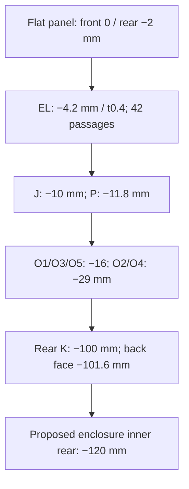

## Conditional nine-board decision

The source decision is `design/partition/partition.json`, generated from `partition-input.json`, the native master netlist and retained component drawings. Authority is **PROPOSAL (planning, owner-delegated)**. Every schematic and board remains an **unvalidated draft**. No PCB is drawn or fabrication output produced by this decision.

All **438 panel centres and 33 modules remain fixed**. The partition assigns all 5,904 physical master rows, including eight DNP rows, exactly once: 5,896 fitted parts and 650 fitted IC packages. Abstract `CN301` and `XB301` stay in the audit but have no physical footprint or invented conductive connection. The five octave adapters retain their selected 3+2 arrangement.

| Board | Panel-frame outline, mm | F.Cu z, mm | Stack | Main assignment |
| --- | --- | --- | --- | --- |
| `osc-jack` / J | x4–314, y20–164 | −10 | 4 layers, 1.6 mm, 2 oz | 180 jacks, 102 indicators and complete local input/output circuits |
| `osc-control` / P | (1,194), (94,194), (94,176), (317,176), (317,292), (1,292) | −11.8 | 4 layers, 1.6 mm, 2 oz | All 101 pots, 30 toggles, eight buttons, complete slew/control circuits |
| `osc-stage-optical` / EL | x210–317, y164–277 | −4.2 | 2 layers, 0.4 mm, 1 oz | 12 stage LEDs and complete 138-part driver/local-net island set |
| `osc-octave-1`…`5` | 19.8 × 21 at each fixed shaft; 6 mm wide tongue to y171 | −16 for O1/O3/O5; −29 for O2/O4 | 2 layers, 1.6 mm, 1 oz | One exact selector per adapter |
| `osc-core` / K | (4, 8), (314, 8), (314,246), (258,246), (258,292), (4,292) | −100 | 4 layers, 1.6 mm, 2 oz | Distinct rear core, reference buffers and conditional load-side star |

F.Cu faces the panel. Circuit boards use internal AGND and power planes. K's rear component height ceiling is 5 mm: with its rear face at −101.6 and proposed enclosure inner rear at −120 mm, the nominal remaining gap is 13.4 mm. The enclosure is a **dimensioned proposal**, not a selected or fitted case.

The source engineering overview is `design/partition/board-stack-candidate.svg`. The diagram is a courtyard-capacity proposal, not a solid assembly or routed PCB.

## What the geometry checks establish

`floorplan-candidate.json` gives every master package a complete courtyard and face. J needs both faces: large packages remain behind the jack board and some passives occupy the front gaps. All timing, hold, summing, integrator and slew nodes remain on their assigned board; no island or physical package crosses a connector. The downstream placer must consume the per-reference face map, preserve package bypass proximity, and review the local vias/return loops. Capacity does not establish routability.

The current exact GH footprints fit 390 header sites. The123 K/P GH3 ports rotate90 degrees on P, giving1.05 mm nominal clearance to pot mounting-pad copper. Free-part spacing is0.35 mm between drawn courtyards and 0.30 mm at edges; the pinned KiCad oracle observes0.045 mm cached-courtyard inflation per edge, bounded by 0.05 mm in the checks. On each octave adapter, GH7 leaves 0.35 mm; GH8 overlaps by 0.27 mm and is rejected. These are nominal drawings, not tolerance-qualified clearances.

The compact Kingbright footprints cover all 104 white `APHHS1005QWF/D` and ten red `APG1005SEC/E-T` emitters. Jack LEDs now have 0.35 mm minimum nominal courtyard clearance; paired indicator courtyards have 0.8 mm. Stage LEDs still overlap the pot mounting copper at a common plane, so their entire driver, bypass, LED, sense and 1.2 kΩ limiter circuits move to EL.

EL has 18 toggle-body passages, six guided-button passages and 18 shaft passages, including the six offset ATTEN shafts. Thirty-five internal M2 support locations have exact coordinates. EL's nominal front component/panel gap is 0.45 mm; its rear gap is 0.4 mm **only if** the nonpassing pot-body front stays at or behind z=−5 mm. Those small gaps require a tolerance and stiffness coupon. The 0.4 mm two-layer exception uses sparse local LED loops and rear AGND fill; it does not waive return continuity or thin-board assembly support.

## Hardware datums and force paths

The complete datum table is `mechanical-candidate.json`. Jack seating/shoulder and pot PCB-to-tip/body datums remain **UNSOURCED**. Toggle drawings contain candidate dimensions but do not establish the installed unsuffixed variants. Consequently J/P planes are requirements for a conditional draft, not claims that the hardware reaches the panel.

Jack nuts clamp directly to the flat panel. Bushingless pots and tactile-button bodies need a captive insulating carrier transferring knob torque and button force into the enclosure. B3F-1020 stays the exact button candidate; at P's plane its nominal top is −6.8 mm, with proposed 7.8 mm guided plungers through 5 mm apertures. Travel stops and side loading remain unqualified. The existing selector M9 carrier, extensions and indexed knobs remain unchanged.

J has eight edge M2 supports; P has six at x3.5/314.5. P was widened to x1–317 to keep its 3.2 mm collars outside the pot courtyards. K has eight edge M2 supports. The 35 EL posts terminate in the control/body carrier; 30 require internal P clearances and five are above P's outline. **They create zero front-panel support holes.** Proposed segmented enclosure clips may use clear parts of the 0–3 mm perimeter border, excluding projected jack nuts and support collars. No continuous solid lip or exact clip profile is selected; #37 checks the border against artwork and #65 owns installed fit.

No solder joint or connector friction is a structural load path. Proposed test loads include 30 N jack insertion, 10 N lateral knob load, 0.2 N·m knob torque, 5 N button/cable loads and 10 g transport inertia. No strength pass follows from listing those loads.

## Exact internal harnesses and service

There are 195 GH harnesses: 127 GH3, ten GH7 and 58 GH8. Each uses the exact JST `BM0xB-GHS-TBT(LF)(SN)` **top-entry** header, `GHR-0xV-S` housing and `SSHL-002T-P0.2` contacts. Its 7.3 mm mated height is a manufacturer reference at each local PCB face; cables span the different planes. No rigid board-stack height is inferred.

The design has 1,830 header contact positions. Across the whole harness set at each end, 915 positions comprise 513 signals, 380 AGND, 18 rails and four unwired NC positions. The 911 fitted wires require 1,822 crimps across both ends. The source netlist drives every pin map. Manufacturer numbering and both mechanical pads are retained. K/P GH3 pairs use source clockwise angles P=90 and K=270 degrees; other K mates use 180 degrees, while the four J/P loops keep source 0 degrees. Explicit `kicad_orientation_deg` fields and an in-memory KiCad transform oracle remove ambiguity between source reflection and native angle conventions.

The retained Alpha Wire 6821 drawing specifies AWG26, 0.889 ±0.0508 mm insulation diameter, 38 Ω/1000 ft nominal resistance and a ten-diameter bend radius. The maximum diameter is 0.9398 mm and the conservative individual-wire bend requirement is 9.398 mm. Controlled flat ribbons maintain 1.25 mm conductor pitch. Combs anchored to the enclosure sit within 15 mm of each connector and at most 25 mm apart. The longest proposed cut is 204 mm; aggregate source-driver cable capacitance remains limited to 1 nF and requires assembled verification.

`loom-candidate.json` checks all 195 ribbon corridors and twelve load-side power-wire curves against each other and the EXT reservation. Four J/P harnesses use separate broad loops in left-hand corridors. Free P connector sites were relocated away from the inlet pocket; no control moved.

K includes 191 proposed Ø2.2 mm service apertures and collision-checked approaches for a 1.5 mm hook tool. These are a tooling proposal, not proof that the JST latch releases with that tool. Service is unpowered: disconnect the external source, verify discharge, remove the rear cover, release loom combs, unlatch all K mates through the access apertures, then remove K supports. Factory local backing is required for mating, especially on EL.

## Power and common returns

The selected architecture remains one **EXT requirement-only domain**, with no selected source or orderable inlet. Preserve x260–308/y248–293/z−85…−45 mm for its inlet, support and cable access. No rejected P+B trays return to this design. Continuous minima are 1700/1600/300 mA; transient minima 2000/1900/400 mA; delivered maxima 2100/2000/500 mA. The single-return envelope is 4.6 A.

Twelve proposed factory-soldered Alpha Wire 5859 AWG14 conductors connect existing load-side rails/AGND between K and J/P. They do not bridge `CN301`/`XB301`, and they do not replace the separate source-inlet 20 AWG contract. Each has a 125 mm maximum length, a hot-resistance acceptance ceiling of 13 mΩ/m, combined termination allowance 0.2 mΩ, rail-plane ceiling 1 mΩ and return-plane ceiling 0.5 mΩ. At the delivered-current maxima, the worst shared-return distribution loss is **16.628 mV**, below the 20 mV allocation. Actual hot copper, solder-joint resistance and ampacity remain unmeasured.

GH contacts are rated 1 A at AWG26; the proposed assembled limit is 0.5 A/contact. Normal all-mates-present AGND bounds use the lowest possible resistance of one wire path and the highest allowed resistance of every other path plus the dedicated return. Three independent AWG14 ground wires per J/P are included. The complete combined branch-board plus K AGND spreading/neck must be no more than 0.5 mΩ, including vias. Conservatively, all alternative returns share that resistance while the candidate GH path has zero PCB/contact resistance. This is a routing extraction and hot measurement requirement for #38/#39/#43/#65. The AWG26 wire lower bound of 0.1 Ω/m is an acceptance condition across the qualified temperature range, not a manufacturer guarantee; cold qualification is NOT RUN. They give 0.443 A for J and 0.492 A for P (only 8.125 mA planning margin), plus 0.250 A for the J/P utility returns. Actual hot routing must meet the combined neck limit or the returns need redesign; they **do not assume equal sharing**. A missing main return, partial mating or external patch-ground fault is outside this normal result and remains open under #59/#65.

EL uses six rail paths and twelve AGND paths. Conservative rail contracts are 50/50/70 mA, with a 170 mA total absolute return bound. They include all six quad packages, all 12 base resistors, the 12 current-limited LEDs, pullups and the ≥10 ms bulk ramp. Current may be unequal; voltage-drop bounds use the sum of the minimum path conductances.

Four powered boards reserve 4.7 µF per rail in 12 finite 5×3 mm courtyard slots. These unselected bulk parts must meet the reserved height (EL at most 1.75 mm, other boards at most 5 mm) or trigger a partition replan. The generated supply report supplies the fitted totals; including 18.8 µF new bulk per rail gives 68.7/61.5/43.3 µF nominal, below 150/150/100 µF. Exact unplaced bulk/protection geometry remains conditional. All existing rail-ledger entries and reference fanout bounds remain counted once.

## Alternatives and downstream ownership

The original one-core partition forced raw TIP nets across connectors or overfilled J. #60 supplied the legal I/O cuts; #62 repaired reference fanout. A common P/LED plane still collides at the fixed stage centres. A spanning front optical board over all hardware needs body passages and usable-area proof; it is not adopted. The corrected compact LEDs make a second jack optical board unnecessary.

An eight-board comparison distributing all core circuitry onto interface boards did not retain the distinct rear core required by D09. A shallow K plane forces crowded loops and crosses the rear selector envelopes. The deeper core is a proposal that makes controlled internal wiring possible; its enclosure depth still needs qualification.

#38 owns J; #39 owns P and all five O adapters; #42 owns EL; #43 owns K. #40 and #41 verify their complete reassignment to P and then record **SKIP**. #36 projects the nine board schematics and checks joined net parity, including 390 headers and 24 custom load-side copper terminals. #37 regenerates the panel while preserving all centres/artwork. Exact issue amendments are retained in `design/partition/downstream-handoff-35.md`.

Physical gates stay open: **#65** main supports/seated hardware/loom/service/depth, **#55** selectors, **#57** source realization, **#59** 82 output / 16 precision-sense / 30 octave-receiver protection obligations, and **#64** optical/hot LED behavior. Routing, DRC and actual assembly are **NOT RUN** here.
