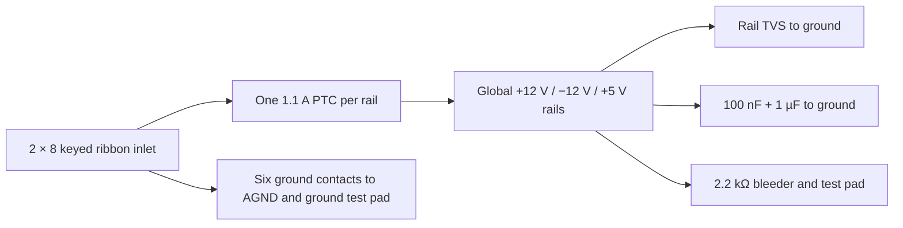

> **Unvalidated draft — not bench tested.** The zudo-pd revision is **design-locked, not as-built**. The six source hashes in `design/power/zudo-pd-lock.json` were recomputed from commit `f25194fa73ded724e82d4561307c106480fbd9ce` and match issue #24. There is no evidence that those boards have been built, ordered, programmed, or measured.

## Selected draft decision after issue #48

The [supply architecture decision](../decisions/osc-supply-architecture.mdx) supersedes the historical P+B reuse intent below. The current report-derived requirements are:

{/* power-current:start */}

All 33 signal modules, the shared reference, 347 worksheet loads and 650 fitted IC packages belong to `EXT`. These counts describe the captured master; the separate protection candidate is not a fitted implementation.

| Requirement | +12 V | −12 V (magnitude) | +5 V |
| --- | --- | --- | --- |
| Normal planning load including allowances | 1,534.819 mA | 1,435.569 mA | 224.286 mA |
| Minimum continuous delivery | 1,700 mA | 1,600 mA | 300 mA |
| Minimum transient delivery for at least 20 ms | 2,000 mA | 1,900 mA | 400 mA |
| Maximum delivered current, including limiter tolerance | 2,100 mA | 2,000 mA | 500 mA |
| Full capacitance ramp increment | 224.64 mA | 222.66 mA | 62.40 mA |
| Source magnitude band, including ripple | 12.00…12.30 V | 12.00…12.20 V | 5.05…5.10 V |
| Required voltage magnitude at load | 11.53…12.48 V | 11.74…12.37 V | 4.81…5.20 V |

These are conditional planning requirements, not measured source capacity or guaranteed whole-instrument maxima. Source, inlet and mate remain **NOT SELECTED**; protection remains open in #59 and physical qualification **NOT RUN** in #57.

{/* power-current:end */}

#52 captures a logical eight-pin inlet and an unimplemented raw-to-load boundary with no footprint or BOM line. The native netlist confirms distinct source and load nets; no protection circuit is implemented. Its exact realization remains open in [#59](https://github.com/Takazudo/zudo-osc-hole-field/issues/59). The historical 16-contact inlet/PTC circuit is comparison evidence only. Physical source realization, thermal/startup, cable and power-off gates remain in [#57](https://github.com/Takazudo/zudo-osc-hole-field/issues/57).

{/* power-capacitance:start */}

The captured master rail-attributed capacitor inventory is **49.9 / 42.7 / 24.5 µF** on +12/−12/+5 V, leaving **100.1 / 107.3 / 75.5 µF** nominal against the source-contract ceilings before unplaced board bulk. Local VEE5 and filtered NOISE_VDD capacitors count against their upstream rails. This is the master inventory, not a census of completed board copper or the unfitted protection candidate. Reconcile every board reservoir and selected protection capacitor; per-pin proximity and effective ceramic capacitance remain open.

{/* power-capacitance:end */}

The #58 prospective local-quad isolation sensitivity is research only, not fitted protection. The open output, feedback and reference obligations are recorded in `design/power/downstream-handoff-52.md`; #59 must reconcile the selected circuit's full demand.

## Historical pinned source contract (not selected)

The original intended source was zudo-pd Board P (USB-PD input) stacked on Board B (power conversion). That historical design used a factory-made ribbon cable into the matching 2 × 8, 2.54 mm shrouded IDC header, DEALON `DW254P-2X8-L0` (`C4749189`). The supply's screw terminals are excluded because they provide a single ground pole and require hand wiring. Connector orientation, cable assembly, and offset/reversal protection remain physical qualification gates.

| Property | Design assumption at the locked source | Evidence state |
| --- | --- | --- |
| Rails | +12 V, −12 V, +5 V, ground | Design contract; output under load unmeasured |
| Current capacity | +12 V 1.2 A; −12 V 0.8 A; +5 V 0.5 A | Supply design targets, not measured or guaranteed |
| Synth design ceiling | +12 V 0.96 A; −12 V 0.64 A; +5 V 0.40 A | Project choice: 80% of targets, not measured capacity |
| Voltage band to tolerate | +12 V 11.53–12.48 V; −12 V −11.74 to −12.37 V; +5 V 4.81–5.20 V | Design requirement; tolerance after cable/protection loss unmeasured |
| Ripple | Below 1 mVp-p target | Unmeasured at source and synth |
| Per-rail output protection | Resettable fuses with 1.5/1.5/1.1 A hold and output clamp diodes are on Board B | Design-source components; response to synth-side faults unmeasured |
| Startup | Inverting converter may request about 4.5 A for 2 ms against a 3 A source | Analysis concern; startup, source trip, and retry unmeasured |
| Sequencing | Three independent converters, no power-good output | Rail order and partial-rail behavior unmeasured |

Connector pins are fixed: **1–2 −12 V; 3–8 ground; 9–10 +12 V; 11–12 +5 V; 13–14 CV bus; 15–16 gate bus**. Pins 13–16 are pass-through pins at the supply and must remain **unconnected on the synth**. No power-good signal is available. Every input protection switch and rail clamp must tolerate rails arriving in any order or missing while ground remains connected.

## Historical captured synth-side inlet (superseded)

Before #52, the generated `01_power_interfaces` sheet kept the three incoming ribbon rails separate from the instrument rails. Each incoming rail passed through a TECHFUSE `mSMD110-33V` resettable fuse (1.10 A hold at 25 °C), then reached the global instrument rail. A shunt unidirectional TVS went from each instrument rail to ground: High Diode `SMAJ15A` on both 12 V rails, with its cathode on +12 V and its anode on −12 V; Brightking `SMAJ6.5A` on +5 V, cathode toward the rail. The exact candidate source files, hashes and limits remain in `design/power/protection-source-lock.json`. The current requirement-only sheet keeps local 100 nF + 1 µF filtering, one 2.2 kΩ bleeder per rail and test pads; the old PTCs and TVSs are not present.

The PTC sheet lists `R1max` as 0.250 Ω but does not establish the worst normal-operation voltage drop in this assembly, and it has no ambient derating chart. As an illustrative calculation, 0.96 A through 0.250 Ω would drop 0.24 V before cable/board losses; thermal hold current and voltage at the load are **NOT ESTABLISHED**. The TVS data are pulse-specific: SMAJ15A can clamp as high as 24.4 V and SMAJ6.5A as high as 11.2 V under their specified 10/1000 µs pulse. These values do **not** prove that a miswired cable is safe for the ICs. Fault-energy and shifted-cable tests remain mandatory. The six ground contacts are directly common; pins 13–16 are explicit no-connects.

## Synth-side design rules

The current requirement-only sheet contributes 1.1 µF nominal capacitance per rail, or 1.32 µF per rail at +20% tolerance. Bleeders draw about 5.455 mA on each 12 V rail and 2.273 mA on +5 V at nominal voltage; this load remains in the finished planning budget. Across the entire synth, nominal added bulk capacitance may be at most **150 µF on +12 V, 150 µF on −12 V, and 100 µF on +5 V**, including the 100 nF supply decouplers and initial 4.7 µF per board rail; use +20% capacitance tolerance in startup arithmetic. The fitted rail-attributed count is reported above, but the board partition and full bulk placement remain open, so the final capacitance total is **NOT ESTABLISHED**.

The historical issue #33 budget and #34 escalation are retained in the [rail budget decision](../decisions/osc-rail-budget.mdx). Their earlier single-source subtotals are not the current source contract. The [supply decision](../decisions/osc-supply-architecture.mdx) now derives its comparison tables from the current report. Complete typical and guaranteed maximum instrument currents remain **NOT ESTABLISHED**; physical source and return-path qualification remain open.

The [instrument rail planning ledger](./osc-rail-ledger.mdx) traces the captured IC packages and worksheet loads to their rails. Its A/B feed labels remain historical comparison evidence; the selected requirement uses one `EXT` domain. Reverse polarity, offset wiring and fault-energy behavior require the actual selected inlet and protection circuit. A shroud, supply fuse or clamp does not establish survival.

## Historical P+B 15 V-only bring-up precondition

If the project returns to the pinned P+B supply, its USB-PD controller ships advertising a 20 V request at top priority, while its input bus has a 16 V clamp diode that conducts at a 20 V contract. Before connecting any 20 V-capable charger, program the controller memory for **5 V and 15 V only** and read back the programmed image. First power must come from a current-limited 5 V source with Board B disconnected. No programmed image or readback is retained; this is an **open bring-up gate**, not a claimed configuration.

## Verification still required

- Verify connector mate, keying, pin-1 mark, factory cable orientation, and survival or safe failure for shifted and reversed insertion.
- Measure rail order, startup/retry, ripple at the synth, cable drop, current and thermal rise under the finished load.
- Audit total added bulk capacitance and every IC's power-off or missing-rail behavior after board partitioning.
- Confirm supply mounting-pocket access, depth, grounding and service removal with populated hardware.

No fabricated or bench-tested instrument exists in this record. Schematic ERC and netlist parity, when run, check the captured connectivity only.
