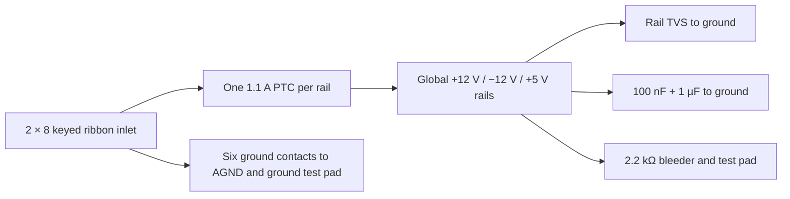

> **Unvalidated draft — not bench tested.** The zudo-pd revision is **design-locked, not as-built**. The six source hashes in `design/power/zudo-pd-lock.json` were recomputed from commit `f25194fa73ded724e82d4561307c106480fbd9ce` and match issue #24. There is no evidence that those boards have been built, ordered, programmed, or measured.

## Supply contract

The intended source is zudo-pd Board P (USB-PD input) stacked on Board B (power conversion). The synth uses a factory-made ribbon cable into the matching 2 × 8, 2.54 mm shrouded IDC header, DEALON `DW254P-2X8-L0` (`C4749189`). The supply's screw terminals are excluded because they provide a single ground pole and require hand wiring. Connector orientation, cable assembly, and offset/reversal protection remain physical qualification gates.

| Property | Design assumption at the locked source | Evidence state |
| --- | --- | --- |
| Rails | +12 V, −12 V, +5 V, ground | Design contract; output under load unmeasured |
| Current capacity | +12 V 1.2 A; −12 V 0.8 A; +5 V 0.5 A | Supply design targets, not measured or guaranteed |
| Synth design ceiling | +12 V 0.96 A; −12 V 0.64 A; +5 V 0.40 A | Project choice: 80% of targets, not measured capacity |
| Voltage band to tolerate | +12 V 11.53–12.48 V; −12 V −11.74 to −12.37 V; +5 V 4.81–5.20 V | Design requirement; tolerance after cable/protection loss unmeasured |
| Ripple | Below 1 mVp-p target | Unmeasured at source and synth |
| Per-rail output protection | Resettable fuses with 1.5/1.5/1.1 A hold and output clamp diodes are on Board B | Design-source components; response to synth-side faults unmeasured |
| Startup | Inverting converter may request about 4.5 A for 2 ms against a 3 A source | Analysis concern; startup, source trip, and retry unmeasured |
| Sequencing | Three independent converters, no power-good output | Rail order and partial-rail behavior unmeasured |

Connector pins are fixed: **1–2 −12 V; 3–8 ground; 9–10 +12 V; 11–12 +5 V; 13–14 CV bus; 15–16 gate bus**. Pins 13–16 are pass-through pins at the supply and must remain **unconnected on the synth**. No power-good signal is available. Every input protection switch and rail clamp must tolerate rails arriving in any order or missing while ground remains connected.

## Captured synth-side inlet

The generated `01_power_interfaces` sheet keeps the three incoming ribbon rails separate from the instrument rails. Each incoming rail passes through a TECHFUSE `mSMD110-33V` resettable fuse (1.10 A hold at 25 °C), then reaches the global instrument rail. A shunt unidirectional TVS goes from each instrument rail to ground: High Diode `SMAJ15A` on both 12 V rails, with its cathode on +12 V and its anode on −12 V; Brightking `SMAJ6.5A` on +5 V, cathode toward the rail. Each rail has local 100 nF + 1 µF filtering, a Yageo `RC0603FR-072K2L` 2.2 kΩ bleeder, and a test pad. Ground has its own pad. The exact candidate source files, hashes and limits are in `design/power/protection-source-lock.json`.

The PTC sheet lists `R1max` as 0.250 Ω but does not establish the worst normal-operation voltage drop in this assembly, and it has no ambient derating chart. As an illustrative calculation, 0.96 A through 0.250 Ω would drop 0.24 V before cable/board losses; thermal hold current and voltage at the load are **NOT ESTABLISHED**. The TVS data are pulse-specific: SMAJ15A can clamp as high as 24.4 V and SMAJ6.5A as high as 11.2 V under their specified 10/1000 µs pulse. These values do **not** prove that a miswired cable is safe for the ICs. Fault-energy and shifted-cable tests remain mandatory. The six ground contacts are directly common; pins 13–16 are explicit no-connects.

## Synth-side design rules

The inlet sheet contributes 1.1 µF nominal capacitance per rail, or 1.32 µF per rail at +20% tolerance. Bleeders draw about 5.455 mA on each 12 V rail and 2.273 mA on +5 V at nominal voltage; this load must be added to the finished budget. Across the entire synth, nominal added bulk capacitance may be at most **150 µF on +12 V, 150 µF on −12 V, and 100 µF on +5 V**, including the 100 nF per IC supply-pin decouplers and initial 4.7 µF per board rail; use +20% capacitance tolerance in startup arithmetic. The partition and captured IC count are not complete, so the final capacitance total is **NOT ESTABLISHED**. Added capacitance can worsen the unqualified startup case.

The issue #33 captured master budget supersedes the earlier preliminary model. Its reported planning upper subtotals, including the issue #24 worst-voltage/resistance inlet bleeders, are **1,404.819 mA on +12 V, 1,313.569 mA on −12 V, and 177.286 mA on +5 V**. They exceed the +12 V 960 mA ceiling by **444.819 mA** and the −12 V 640 mA ceiling by **673.569 mA**. Complete typical and guaranteed maximum currents remain **NOT ESTABLISHED**; the supply targets themselves are unmeasured. Issue #34's option review in `design/power/rail-budget-resolution.md` shows that even deliberately overgenerous op-amp, LED and DC-pot savings leave a −12 V planning deficit. It follows the prescribed fourth case: propose a second supply feed for later engineering review, without designing one or changing this captured circuit. The board partition is gated on a source-backed current closure and physical supply/return-path qualification, tracked in [issue #48](https://github.com/Takazudo/zudo-osc-hole-field/issues/48). See the [rail budget decision](../decisions/osc-rail-budget.mdx).

The [instrument rail planning ledger](./osc-rail-ledger.mdx) now traces 634 fitted IC packages and 347 worksheet loads to their actual rails, adds the omitted S&H +12 V reference and +5 V logic draft allowances, and assigns all complete modules to provisional feed domains. Even with two full inlets, the conditional −12 V planning total is 1,319.448 mA, **39.448 mA above two inherited 640 mA ceilings**. Neither feed B nor source-side capacity is qualified; issue #48 remains the source decision gate.
Reversed or offset ribbon insertion must not silently connect a rail to the wrong circuit. A shroud alone does not prove this. The protection topology, exact parts, fault-energy arithmetic, and an offset-cable test need to be reviewed against the paired supply before fabrication. The supply's output fuses and clamps are not proof that the synth survives every insertion fault.

## 15 V-only bring-up precondition

The supply's USB-PD controller ships advertising a 20 V request at top priority, while its input bus has a 16 V clamp diode that conducts at a 20 V contract. Before connecting any 20 V-capable charger, program the controller memory for **5 V and 15 V only** and read back the programmed image. First power must come from a current-limited 5 V source with Board B disconnected. No programmed image or readback is retained; this is an **open bring-up gate**, not a claimed configuration.

## Verification still required

- Verify connector mate, keying, pin-1 mark, factory cable orientation, and survival or safe failure for shifted and reversed insertion.
- Measure rail order, startup/retry, ripple at the synth, cable drop, current and thermal rise under the finished load.
- Audit total added bulk capacitance and every IC's power-off or missing-rail behavior after board partitioning.
- Confirm supply mounting-pocket access, depth, grounding and service removal with populated hardware.

No fabricated or bench-tested instrument exists in this record. Schematic ERC and netlist parity, when run, check the captured connectivity only.
