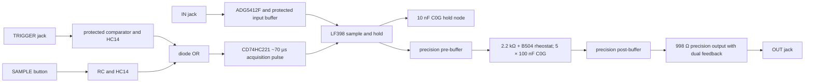

> **Unvalidated draft — not bench tested.** This is OSC-ES-1 **PROPOSAL (planning, owner-delegated)**. Generated KiCad connectivity and an ideal RC model were checked; no fabricated board, hold accuracy, protection, stability, rail budget or physical fit was validated.

## Contract and instance binding

H1 and H2 are two instances of the **same generated `sample_hold.kicad_sch` family sheet**. KiCad gives each instance separate local nets and reference designators. The R21 handoff's sections `62_sample_hold` and `63_post_hold_slew` are circuit groups on this one A1 shared sheet: splitting them into two child pages with the present generator would require a cross-page global label and would incorrectly join H1 and H2 `RAW_HELD` outputs. No panel coordinates moved.

| Function | H1 locked UID / ref | H2 locked UID / ref |
| --- | --- | --- |
| Trigger jack | `J:H1.TRIGGER` / `J509` | `J:H2.TRIGGER` / `J510` |
| Signal input jack | `J:H1.IN` / `J609` | `J:H2.IN` / `J610` |
| Sole output jack | `J:H1.OUT` / `J709` | `J:H2.OUT` / `J710` |
| SAMPLE button | `C:H1.SAMPLE` / `SW607` | `C:H2.SAMPLE` / `SW707` |
| SLEW pot | `C:H1.SLEW` / `RV807` | `C:H2.SLEW` / `RV808` |
| Trigger magnitude LED | `L:H1.TRIGGER.mag` / `D509` | `L:H2.TRIGGER.mag` / `D510` |
| Input magnitude LED | `L:H1.IN.mag` / `D609` | `L:H2.IN.mag` / `D610` |
| Output magnitude LED | `L:H1.OUT.mag` / `D709` | `L:H2.OUT.mag` / `D710` |

The source binding audit requires all sixteen UIDs once across the two instances. Every panel part carries its locked per-instance reference and a `PanelUid` sheet-name template; non-panel parts have no panel binding. The three indicators monitor already buffered nodes, and their drivers stay with their LED islands. Jack switch contacts are unused.

Only `OUT` presents the slewed held value; there is no raw-held jack, hidden noise/clock normal, bypass switch, slew CV or gate-tracking mode. Changing IN alone must not capture. A new positive TRIGGER edge or SAMPLE press requests an acquisition pulse; the CD74HC221 is non-retriggerable while busy. That overlap policy is a source-based proposal, not a measured timing result.

## Named net table

| Net | Connected pins | Value / note |
| --- | --- | --- |
| `TRIGGER_TIP` | Trigger jack T → source-facing ADG5412F S | Sleeve to analog return; TN deliberately no-connect. |
| `IN_TIP` | IN jack T → second ADG5412F S | Same protected input topology; no pot loads the jack. |
| `TRIGGER_BUFFERED` | protected input buffer OUT → LM393B biased comparator / trigger LED driver | Monitor is buffered; LM393B uses +12 V/GND and a 4.7 kΩ pull-up to +5 V. |
| `IN_BUFFERED` | protected input buffer OUT → LF398 pin 1 / IN LED driver | LF398 logic and analog input stay separate. |
| `TRIGGER_OR` | BAS16GW-QX cathodes pin 1 × 2 → 100 kΩ pulldown → CD74HC221 B1 pin 2 | Anodes pin 2 receive conditioned trigger and debounced button; approximately 0.7 V drop is an unverified logic margin. |
| `SAMPLE_PULSE` | CD74HC221 Q1 pin 4 → LF398 LOGIC pin 11 | LF398 LOGIC REFERENCE pin 10 is AGND; TI says LOGIC high samples and low holds. |
| `TIMING_RCX`, `TIMING_C` | CD74HC221 pins 15 and 14; 10 kΩ from +5 V to pin 15; 10 nF between 15 and 14 | TI SCHS166F physical p.0 / printed p.1 gives `tW ≈ 0.7 Rx Cx` at 4.5 V: 70 µs nominal starting point. |
| `HOLD_CAP` | LF398 Ch pin 8 → fitted 10 nF C0G to AGND; parallel 100 nF C0805 option DNP | High-impedance **Sensitive** node; choose one population only. No LED, pot or output load attaches. |
| `RAW_HELD` | LF398 OUT pin 7 → precision pre-buffer IN+ | Buffered cross-group signal, locally scoped per H1/H2 instance. No output jack. |
| `SLEW_POT_IN`, `SLEW_STORAGE` | 2.2 kΩ → B504 pin 1; strapped wiper pin 2 and end pin 3 → five parallel 100 nF C0G parts → precision post-buffer IN+ | Storage and rheostat nodes **Sensitive**; 0.5 µF nominal. CW/CCW physical direction still needs drawing and bench confirmation. |
| `SLEW_BUFFERED` | post-buffer OUT → precision output IN+ / OUT LED driver | Output LED shows the glide. |
| `OUT_TIP` | precision output second 499 Ω resistor → OUT jack T; 100 Ω DC feedback senses jack; 1 nF returns driver feedback | The revised fixed cell passes 12/12 TI-model cases; the prior 10 kΩ/100 pF ideal diagnostic failed 6/12. Physical checks remain open. |
| `+12V`, `-12V`, `+5V` | each IC supply pin → its own 100 nF local bypass → AGND | 33 fitted 100 nF positions per instance from the current package count. Three 4.7 µF bulk positions are DNP board-rail reservations until board partition and Murata sourcing are resolved. |

Every cell resolves audio/CV/indicator/precision amplifier roles through OSC-ES-1 data. The sample-and-hold IC is **TI LF398M/NOPB**, the comparator **LM393BIDR**, and the acquisition IC **CD74HC221M96**. Older handoff LM393DR and bare input-clamp defaults were superseded by OSC-ES-1. Signal diode selection is the issue-18 source-backed **Nexperia BAS16GW-QX** proposal. The exact 100 nF Fenghua capacitor source remains incomplete, and DigiKey's Murata bulk-capacitor lifecycle wording is only a distributor report.

## Decisions and alternatives

| Decision | Reason | Alternative left out |
| --- | --- | --- |
| Two source-facing ADG5412F channels before each input buffer | OSC-ES-1 power-off isolation proposal; bare rail clamps can backfeed an unpowered rail. | Naked jack-to-clamp path. |
| LF398 at local 10 nF C0G Ch, with DNP 100 nF footprint | Handoff gives this value; a larger hold part is a test option, not a silent replacement. | Assuming the 100 nF option proves better long-hold behavior. |
| CD74HC221 B1 positive-edge trigger, A1 low, reset high | Manufacturer truth table supports the B rising edge; 10 kΩ/10 nF gives ~70 µs at the datasheet's 4.5 V formula. | Free-running gate tracking or an unbounded sampling window. |
| Two BAS16GW-QX diode OR inputs | Combines two conditioned 5 V logic sources before the one-shot without tying outputs together. | Directly shorting the HC14 outputs. Threshold and overlap behavior still need physical tests. |
| Separate pre/post precision buffers around 2.2 kΩ + B504 + 0.5 µF | Keeps LF398 Ch isolated from the user pot and output load; fast endpoint is a finite lag. | Increasing the LF398 hold capacitor to create the glide. |
| 998 Ω dual-feedback precision output | Bounds output-to-output/fault current under OSC-ES-1; the jack is the DC sense point. | Unsensed low series resistor. Stability is **not qualified**. |
| LF398 OFFSET ADJUST pin 14 explicit no-connect in pilot | No source-backed, valued trim network is selected. Factory offset is a measured gate, not an implied calibration adjustment. | Inventing a trimmer value and asserting offset calibration. |
| Per-IC bypass fitted; per-board bulk footprints DNP | OSC-ES-1 requires local 100 nF at every IC supply pin, while final board count and bulk sourcing are still open. | Assuming one bulk capacitor per module is already the final board-rail allocation. |

## Islands and calibration

`HOLD_LOCAL` includes LF398, both alternative hold footprints and `HOLD_CAP`. `TIMING_LOCAL` includes CD74HC221 timing parts. Each `C:<inst>.SLEW` island includes its pot, 2.2 kΩ minimum resistor, five-capacitor lag bank and both pre/post buffers. `SLEW_STORAGE`, `SLEW_POT_IN`, `HOLD_CAP` and the timing nodes are marked `Sensitive`; the lag and hold nodes must stay on their respective local board. The output cell and each indicator driver have separate local grouping. Buffered RAW_HELD, supplies and returns may be considered for board crossings only after the partition decision.

Factory calibration points still to define: LF398 input/output DC offset in sample and hold, 10 nF versus 100 nF hold error and droop, trigger threshold/hysteresis, acquisition pulse width and overlap, fast/centre/slow lag, and OUT load error. No trim network or accessible test-pad arrangement is released here.

## Checks and current boundary

The generated master uses one `sample_hold.kicad_sch` sheet for H1 and H2. The retained whole-master KiCad 10 ERC baseline has **zero errors and 228 exact warning identities**. H1 and H2 contribute **six LED pin-type warnings each**, documented in `schematic/reports/sample_hold-erc-notes.md`. Exported KiCad pin nets match the source spec for both instances, and a deliberate hold-node mutation is detected twice. These checks do not establish protection or performance.

The ngspice ideal RC deck uses unity pre/post buffers and a 0.5 µF equivalent capacitor. Its 10–90% times are **2.41688 ms fast, 277.07004 ms centre, and 551.72308 ms slow**, within 1% of `ln(9) × R × C`. This is a model result, not LF398 or OPA4197 behavior. LF398 acquisition/hold/droop, the CD74HC221 pulse, and output cable stability are **NOT RUN** without validated models and physical measurements.

The per-instance partial current worksheet records **+12 V 34.5 mA typical planning subtotal / 54.85 mA upper planning subtotal** and **−12 V 33.1 / 52.65 mA**. The +12 V REF5050 input/buffered-reference demand, +5 V logic and several dynamic loads are unquantified, so complete typical and maximum currents on all three rails are **NOT ESTABLISHED** (`null` in the machine report). The +5 V known subtotal of zero is not a zero-current claim; HC14, HC221, pull-ups and switching need source-backed limits and measurement. The REF5050 input is on +12 V and is also absent from that rail's known subtotal. The earlier 72.655 mA −12 V deficit belongs to the historical preliminary count model. Use `design/power/rail-budget.json` and `rail-ledger.json` for the later whole-instrument planning allocation, and `supply-architecture.json` for the current external-source requirement. The old sibling-supply ceiling comparison remains historical evidence; it is not the current source contract. The physical source/inlet is **NOT SELECTED**, complete current maxima remain unestablished, and no output or rail budget is qualified.

## Remaining bench and source gates

- Verify positive-edge and manual-button capture, debouncing, diode-OR logic margin, non-retriggerable busy behavior and the actual 50–100 µs acquisition window at ±12 V operation.
- Measure LF398 offset, charge injection, acquisition, hold step, 10 nF/100 nF droop across temperature, power-up state and unpowered input faults. The 10 nF handoff droop estimate is **not** a validated pilot result.
- Measure slew in both directions at each knob point, hot leakage, settling into real capacitance, input transients and 2.2 kΩ / pot stress. Fast is not bypass; the proposal does **not** promise 25-second smoothing.
- Qualify the OPA4197 998 Ω output against the 0/100 pF/1 nF/5 nF cable and open/100 kΩ/10 kΩ load matrix. The revised 100 Ω jack-sense/1 nF local-feedback circuit passes 12 of 12 cases in TI's OPAx197 model. The earlier 10 kΩ/100 pF ideal diagnostic failed six of twelve cases and remains as the starting evidence. Physical cable, layout, temperature and tolerance stability are **NOT RUN**.
- Resolve exact value-specific passive MPNs, source gaps for the Fenghua cap, Murata bulk sourcing, factory-only assembly, panel/board stack and the current source/allocation requirements before any physical design release.
