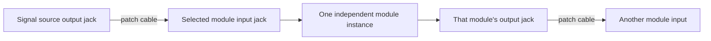

The instrument is a collection of visible, independently patched analogue modules. The R21 handoff fixes the panel layout and module inventory, while circuit topology, signal levels, rail loads, and the final board partition remain engineering work. This overview describes functional boundaries without assigning unverified voltages, impedances, or component capabilities.

## Intended signal path

A user connects module outputs to inputs with patch cables. Each block remains independent until the user makes a connection; the diagram is a functional view, not an electrical netlist.

The panel presents 180 patch jacks above 144 controls. No default inter-module normal is part of the intended behavior, and neither sample-and-hold input has a default noise feed.

## Functional blocks

| Block group | Responsibilities | Interface boundary |
|---|---|---|
| Signal sources | Five oscillator instances and one four-output noise source | Expose outputs for user patching; no automatic source-to-module connection |
| Signal shaping | Three filter modules with parallel VCA outputs and two wavefolders | Receive explicitly patched signals and expose their own outputs |
| Mixing and level control | Two five-input mixers, two four-input mixers with VCA, and six attenuator/offset cells | Combine or adjust only according to each module's eventual circuit contract |
| Utilities | Two buffered one-to-three multiples and two manual A/B selectors | Preserve separate user-visible jacks; buffering and switching behavior require circuit and bench evidence |
| Control and timing | Six attack-release envelopes and two sample-and-hold modules with output slew | Expose their own trigger, control, and signal interfaces; exact semantics remain open |

The imported [module contracts](./osc-blocks.mdx) describe each family's user-visible behavior and circuit work. [S&H + SLEW](./osc-sample-hold-slew.mdx) is an implementation proposal; it does not establish acquisition, hold, or slew performance.

## Physical partitioning

| Boundary | Intent | State |
|---|---|---|
| Front panel | One flat 318 × 298 mm panel with the fixed R21 jack and control grid | Positions are fixed; thickness, mounting holes, and styling release remain open |
| Panel-facing electronics | Boards must support the actual jack, pot, selector, toggle, button, and LED datums | Board count and component-to-panel heights are not mechanically qualified |
| Rear electronics | A core and its connectors are intended to serve the panel-facing boards | The exact partition and connector contract are open pending circuit and mechanical evidence |
| Power assembly | Reuse a separate zudo-pd Board P + Board B design | Reference the pinned remote revision; the physical assembly and instrument load are not established |

See [board partition and panel stack](./osc-board-stack.mdx) and [power reuse](./osc-power.mdx) for the constraints and open measurements. Fixed hardware coordinates come from `design/grid/placements.lock.json`.

## Intended user-level states

| State | User action | Intended behavior | Evidence boundary |
|---|---|---|---|
| Unpowered | Connect the instrument to its external supply | No operation is claimed before a verified power-up procedure exists | Supply revision, rail limits, and safe connection order remain open |
| Ready to patch | Apply power after the design has a verified setup procedure | Independent blocks are available for manual patching | No instrument bring-up result is documented |
| Patch and adjust | Connect outputs to chosen inputs and operate module controls | Signals pass through the selected blocks according to their eventual circuit contracts | Module behavior and levels require circuit review and bench testing |
| Shutdown | Remove power and patch cables | The session ends without a stored patch or automatic routing requirement | Shutdown behavior and hardware protections remain unverified |

These are intended product states, not a tested startup or safety procedure. The first prototype's acceptance criteria and use environment remain to be set by the owner.

## Open architecture questions

- What voltage ranges, impedances, headroom, and connector protection apply to each input and output?
- What are the exact filter GAIN behavior and envelope trigger/retrigger semantics?
- Does the integrated design fit the supply ceilings after real component counts and indicator loads are captured?
- What board partition and connector mates satisfy both the signal boundaries and measured component heights?
- Which physical zudo-pd assembly revision is available for integration, and has that assembly been ordered?

Continue from [next actions](../project/next-actions.mdx), retain design choices in [Decisions](../decisions/index.mdx), and record measured results under [Verification](../verification/index.mdx).
