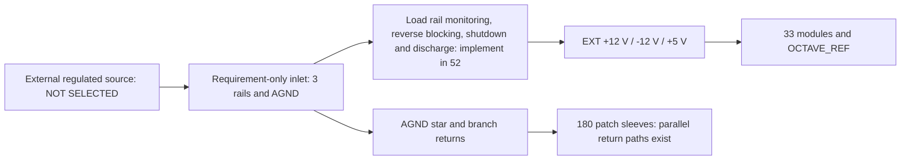

**PROPOSAL (planning, owner-delegated), unvalidated draft.** Select one external regulated-source **requirement contract**, with one instrument domain `EXT`. The physical source, orderable inlet, mate and contacts are **NOT SELECTED**. Physical energization is **NOT AUTHORIZED** by this decision. [Qualification issue #57](https://github.com/Takazudo/zudo-osc-hole-field/issues/57) remains open after draft completion; it preserves the original #24 and #48 requirements.

The authored authority is `design/power/supply-architecture-input.json`; `scripts/schgen/build_supply_architecture.py` produces `design/power/supply-architecture.json`. Authored numeric allocations are PROPOSAL, computed results DERIVED, and the inherited source lock is design evidence, not measured hardware. This changes the original P+B reuse intent under the delegated draft decision. It preserves all 33 modules, 438 fixed panel centres and sensitive islands. #52 must implement this decision; the current inlet schematic is still the historical single-source circuit.

## Why three independent P+B assemblies were considered and rejected

The original single-inlet worksheet comparison remains 1,404.819 / 1,313.569 / 177.286 mA against 960 / 640 / 400 mA planning ceilings. The repaired two-inlet negative-rail case exceeds two ceilings by 39.448 mA. No sensitivity savings are booked. Two connectors on one Board B do not create another source.

Three is the minimum arithmetic candidate. Each assembly would need its own Board P, Board B, upstream PD source and cable at the pinned revision. All five oscillators and `OCTAVE_REF` stay together in A; the remaining whole modules are assigned by the input JSON. The checker traces every worksheet row and fitted IC. Candidate totals include a complete inlet per source, S&H reference/logic sensitivities, NOISE2 sensitivity, 1 mA leakage per rail and 20 mA auxiliary allowance per rail per source. A conditional 10 ms ramp charges the entire allocated capacitance, with one 25 mA analog output-fault allowance per domain.

| Domain | Normal +12 / −12 / +5 mA | Conditional ramp and fault +12 / −12 / +5 mA | −12 V margin to 640 mA |
| --- | --- | --- | --- |
| A | 486.625 / 464.124 / 82.663 | 586.505 / 563.344 / 103.463 | 76.656 mA |
| B | 501.555 / 462.805 / 76.970 | 601.435 / 562.025 / 97.770 | 77.975 mA |
| C | 499.100 / 460.999 / 111.428 | 598.980 / 560.219 / 132.228 | 79.781 mA |

Each separate body is reserved as 116 × 91 × 25 mm. A **proposed 318 × 298 × 90 mm inside enclosure** allocates the rear chamber z=−90…−45 mm, with panel front z=0 and rear negative. Three individual 130 × 105 mm insulating trays occupy these bounds; each has an additional 130 × 25 mm cable-exit corridor. The body sits 8 mm above the rear support face and has 5 mm upper clearance. Actual mounting holes, anchor strength, thermal airflow, board fit and service access remain unqualified.

| Domain | Tray x / y / z bounds (mm) | Cable-exit y bounds (mm) |
| --- | --- | --- |
| A | 10…140 / 10…115 / −86…−48 | 115…140 |
| B | 170…300 / 10…115 / −86…−48 | 115…140 |
| C | 10…140 / 155…260 / −86…−48 | 260…285 |

These disjoint reservations fit the declared chamber and clear the selector's rear envelope, including the 0.5 mm body allowance. This is a computable packaging proposal, not an installed fit result or permission to push the future core board into that chamber. It does not reuse the old single pocket.

The current arithmetic and geometric reservation do **not** establish a usable source interface. Conservatively preserving the original voltage bands at the load leaves no guaranteed drop margin when the pinned source itself reaches the lower boundary: any positive cable/PTC/return drop takes a rail outside that boundary. The original 1.1 A inlet PTC also has no retained ambient derating curve or established normal-operation loss, and the exact DEALON cable mate and all-contact rating remain unsupported. Three unsequenced converters per source, the 4.5 A / 2 ms startup concern against a 3 A upstream source, and powered-off patch backfeed remain unresolved. More assemblies do not repair these interface facts. The decision therefore uses the permitted external-source contract without claiming the candidate is physically impossible.

## Selected requirement and arithmetic

All modules, the shared reference, 347 worksheet loads and 634 fitted IC packages belong to `EXT`. One source drives +12 V, −12 V and +5 V; AGND is common. There is no regulated-output paralleling or inter-domain reference feed. The full ledger is retained as comparison evidence; its A/B labels are superseded for future implementation by this contract.

| Requirement | +12 V | −12 V (magnitude) | +5 V |
| --- | --- | --- | --- |
| Normal planning load including allowances | 1,433.819 mA | 1,334.569 mA | 224.286 mA |
| Minimum continuous delivery | 1,600 mA | 1,500 mA | 300 mA |
| Minimum transient delivery for at least 20 ms | 1,900 mA | 1,800 mA | 400 mA |
| Source magnitude band, including ripple | 12.00…12.30 V | 12.00…12.20 V | 5.05…5.10 V |
| Required voltage magnitude at load | 11.53…12.48 V | 11.74…12.37 V | 4.81…5.20 V |
| Full capacitance ramp increment | 224.64 mA | 222.66 mA | 62.40 mA |

Continuous requirements are the repaired worksheet plus explicit allowances, multiplied by 1.10 and rounded up to the next 100 mA. The allowances include one original worst-case inlet bleeder per rail, 1 mA leakage per rail, 20 mA per rail for protection/supervision/discharge, doubled S&H reference and logic allowances, and another 10 mA NOISE2 sensitivity. No auxiliary circuit has yet been selected to consume those allocations.

Transient requirements add full capacitance charging and 25 mA per analog rail, then round up to 100 mA. The single external opposite-rail output case gives 24 V / 998 Ω = 24.048 mA through its resistor chain; this is not an amplifier-current maximum or an all-output-fault guarantee. The model requires a monotonic ramp no faster than 10 ms. The inherited 150 / 150 / 100 µF nominal limits and +20% tolerance remain; every decoupler, board bulk, reference and local regulator capacitor counts. Use 100 nF per supply pin and initially 4.7 µF per powered board/rail within those totals. #52/#35 must reconcile actual values and effective ceramic capacitance. Arbitrary faster startup, all-output shorts, temperature extremes and unbounded dynamic demand remain outside the planning envelope and inside #57's qualification work.

The <1 mVp-p load ripple target remains. The complete rail/return path may lose at most 0.20 V. Source minima minus this loss yield 11.80 / 11.80 / 4.85 V, inside the inherited bands; shared return displacement can also increase a rail magnitude. The worst return shift is 88 mV, so source maxima plus that shift are 12.388 / 12.288 / 5.188 V, all below the upper load limits. This margin is a requirement on the source and harness, not a claim about the old supply.

## Inlet and return requirement

`OSC-EXT-PWR-8-R1` is a **requirement-only eight-contact interface**, with no orderable footprint. Logical pins 1 / 2 / 3 carry +12V_IN / −12V_IN / +5V_IN; pin 4 is unpopulated; pins 5–8 are AGND. Manufacturer mating-face and PCB numbering must be reconciled from a retained drawing before selecting a footprint. No CV bus, gate bus or upstream power-good pin is used.

The candidate identities are Molex `43045-0800` header, `43025-0800` housing and `43030-0007` female contact, all **NOT SELECTED**, supplier codes unknown. Manufacturer pages report catalog maxima for the [header](https://www.molex.com/en-us/products/part-detail/430450800) and [contact](https://www.molex.com/en-us/products/part-detail/43030-0007); these do not prove simultaneously loaded contact derating. Direct drawing/specification downloads timed out; `design/power/inlet-source-attempts.json` records the URLs and zero-hash SOURCE UNAVAILABLE state. #52 must retain exact primary drawings/rating conditions and promote selected identities through the component evidence workflow, or keep the CAD interface visibly requirement-only. A guessed Molex footprint or a catalog maximum treated as installed capacity cannot pass.

The required assembled rating is at least **5 A per contact with the declared simultaneous loads**, at least 30 V, polarized and latched. Factory-crimped copper conductors must meet 5 A ampacity, at least 20 AWG conductor size, at most 300 mm length and 0.04 Ω/m at the hot condition. Each complete conductor path permits at most 0.008 Ω contact/crimp resistance in addition to wire resistance. These are acceptance requirements, not sourced cable properties. The cable assembly and selected contact must agree on wire insulation/crimp range.

Source or inlet current limiting must allow the required transient delivery while imposing upper bounds of **2.0 / 1.9 / 0.5 A including tolerance**, followed by coordinated shutdown. A minimum source rating is not a maximum fault current; unbounded overshoot or fault energy fails the contract. Actual limiter dynamics remain #52/#57 work.

The checker assumes the full 4.4 A maximum permitted sum can flow in **any one** AGND conductor, avoiding an unsupported equal-sharing assumption. At 0.020 Ω per complete conductor, adding 40 mV protection and 20 mV board-distribution allocations gives worst total losses of 188 / 186 / 158 mV. The maximum source-band continuous output requirement is 39.51 W; the 40 mV protection allowance implies at most 64 / 60 / 12 mW per rail at the declared continuous currents, and the conservative single return path dissipates 0.3872 W during the transient. Connector/contact temperature rise, enclosure heat rejection and actual source losses remain physical requirements. Actual protection must meet both drop and dissipation limits; the old 1.1 A PTC cannot be silently reused at the selected full-instrument analog current. Ground is not fused, switched, or disconnected to cure a loop.

Reserve x=260…308, y=248…293, z=−85…−45 mm for the inlet bracket, mate, latch and cable bend. The mating pair must fit a 30 × 30 × 16 mm body allowance with 15 mm service/bend access. The enclosure bracket and strain relief carry loads; solder joints are not structural supports. The external source has no invented internal envelope or support. The three rejected source trays are comparison geometry and are not installed in this selected topology.

## Startup, off-state and faults

Require an isolated SELV external source output and documented chassis/earth bonding. All patch sleeves share AGND, including when the instrument is off. A patch cable can create a parallel ground path to another instrument or earth; it must never be the sole intentional power return.

#52 must implement load-side three-rail monitoring, inhibited input enables during invalid rails, source reverse blocking and coordinated all-rail shutdown/discharge. The source contract alone cannot prove that an IC survives the interval before shutdown. It must bound the interval and injection at each protection/reference/output path, retaining the original requirement to survive any rail order or missing rail; no upstream power-good is assumed.

A powered external patch can drive the source-facing ADG5412F input or the **output** resistor and precision-sense path into unpowered amplifier rails. Keeping input switches correctly oriented does not protect those output paths. #52 must supply a source-backed isolation or bounded discharge/shunt design and fault-energy analysis; #57 owns actual partial-rail, powered-off and opposite-drive tests. Buffered octave taps remain within EXT, but an unplugged receiver board is still a partial-power case. No live internal service or hot plugging is allowed: power down the source and external patched devices before handling the inlet or internal connectors.

Reversed/shifted wiring, ground-open faults, startup retries, brownout, thermal hold/trip, discharge and restart remain explicit tests. Polarization and TVS pulse ratings alone do not establish survival. Any future return to pinned P+B requires the original current-limited 5 V first power with B disconnected, 5 V/15 V-only programming and retained readback before a 20 V-capable charger. No programmed state, source capacity or physical measurement has been invented.

## Review and continuation

The checker proves complete proposed allocation, arithmetic, distinct candidate source pockets, reference grouping, no parallel regulated outputs and interface compliance **against declared requirements**. It does not prove the current netlist implements those requirements, source availability, actual connector ratings, complete load maxima or physical behavior. Negative tests inject omitted loads, joined rails, overloaded return contacts, voltage loss, reference crossings and enclosure collisions.

#52 implements the electrical contract and records exact remaining evidence gaps. #35 consumes the selected single-domain inlet reservation and selector keepouts; it does not add the rejected three source trays. #57 stays open for source realization and all physical qualification. Build/site checks belong to the manager's merged-base verification. Physical, connector, thermal, startup and fit checks are **NOT RUN** because no selected source or populated assembly is available.
